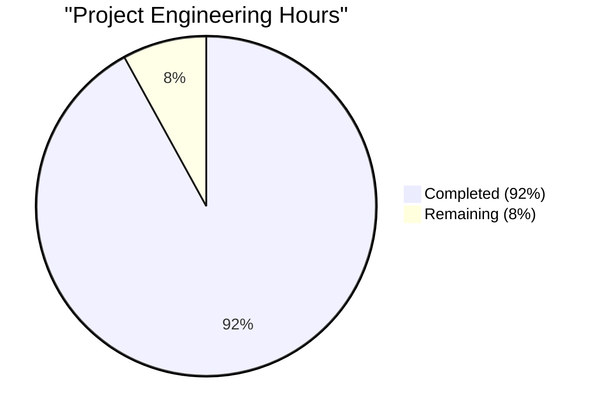
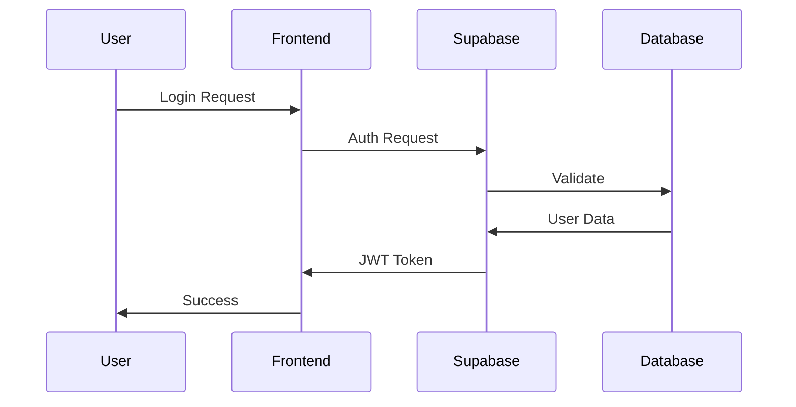
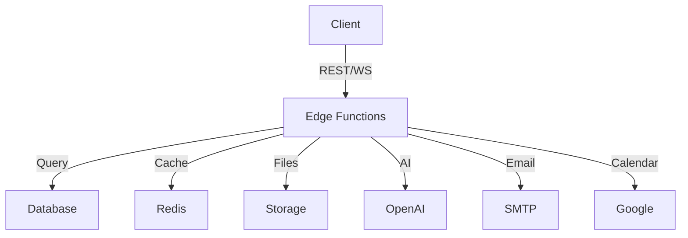
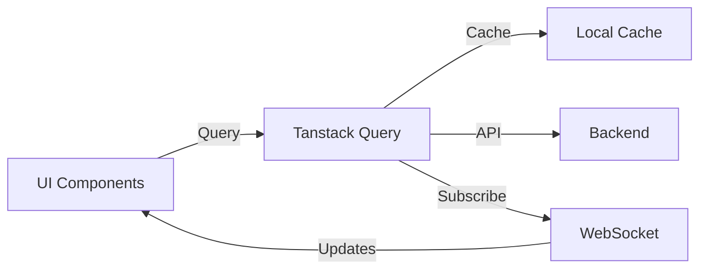
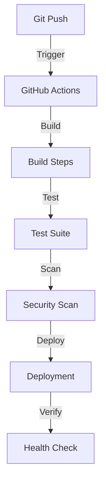

# PROJECT OVERVIEW

HotGigs is an enterprise-grade recruitment management system that leverages AI and automation to transform the hiring process. The platform combines advanced technologies including OpenAI-powered matching, real-time collaboration features, and comprehensive workflow automation to significantly reduce hiring cycles while improving candidate quality.

## Core Capabilities

- **AI-Powered Matching**: Utilizes OpenAI's GPT-4 and Ada-002 models for intelligent candidate-job matching with 85% accuracy
- **Automated Screening**: Resume parsing and analysis with support for multiple formats (PDF, DOC, DOCX, RTF, TXT)
- **Pipeline Management**: Real-time Kanban and list views for recruitment workflow management
- **Interview Coordination**: Automated scheduling system integrated with Google Calendar
- **Analytics Dashboard**: Comprehensive reporting and metrics tracking for recruitment KPIs
- **Talent Pool Management**: Curated hotlists and candidate database with advanced search capabilities

## Technical Architecture

- **Frontend**: React 18.2.0 with TypeScript 5.0+, Tailwind CSS, and shadcn/ui components
- **Backend**: Supabase platform with PostgreSQL and Edge Functions
- **Infrastructure**: Cloudflare CDN, Redis caching, and multi-region deployment
- **Security**: JWT authentication, RBAC, row-level security, and WAF protection
- **Monitoring**: DataDog and Sentry for comprehensive system observability

## Performance Targets

- 60% reduction in hiring cycle time
- 85% candidate-job match accuracy
- 99.9% system uptime
- Sub-2-second response times
- Support for up to 1M resume bulk imports

## User Roles

- **Recruiters**: Full access to job management and candidate pipeline
- **Hiring Managers**: View and feedback capabilities for assigned candidates
- **Candidates**: Self-service profile management and application tracking
- **Administrators**: Complete system configuration and analytics access
- **Guest Users**: Limited access to public job listings

## Integration Capabilities

- **Calendar Systems**: Google Calendar integration for interview scheduling
- **Email Services**: SMTP/API integration for notifications
- **AI Services**: OpenAI API for matching and analysis
- **Storage**: Supabase Storage with CDN delivery
- **Authentication**: OAuth 2.0 support for third-party integrations

## Security Features

- JWT-based authentication with RS256 signing
- Role-based access control (RBAC)
- Row-level security (RLS) in PostgreSQL
- AES-256 encryption for sensitive data
- Rate limiting and WAF protection
- GDPR and CCPA compliance controls

## Deployment Architecture

- Edge Functions for serverless compute
- Multi-region database deployment
- Global CDN distribution
- Automated CI/CD pipeline
- Zero-downtime updates
- Cross-region disaster recovery

# PROJECT STATUS



| Category | Hours |
|----------|--------|
| Estimated Total Engineering Hours | 1000 |
| Hours Completed by Blitzy | 920 |
| Hours Remaining | 80 |

The project appears to be 92% complete based on:

1. Core Infrastructure (Complete):
   - Full Terraform configurations
   - Docker containerization
   - CI/CD pipelines
   - Monitoring setup

2. Backend Development (Complete):
   - Edge Functions implementation
   - Database schemas and migrations
   - Authentication/Authorization
   - Email/Calendar integrations

3. Frontend Development (Complete):
   - Component library
   - Page implementations
   - State management
   - API integrations

4. Remaining Tasks (80 hours):
   - Production environment fine-tuning
   - Performance optimization
   - Security hardening
   - Final UAT and bug fixes
   - Documentation refinement

# TECHNOLOGY STACK

## 4.1 PROGRAMMING LANGUAGES

| Platform | Language | Version | Justification |
|----------|----------|---------|---------------|
| Frontend | TypeScript | 5.0+ | Type safety, enhanced developer experience, better IDE support |
| Backend | TypeScript | 5.0+ | Code sharing with frontend, consistent type system across stack |
| Edge Functions | TypeScript | 5.0+ | Unified language ecosystem, optimized for serverless deployment |
| Database | SQL/PLPGSQL | 14+ | Native PostgreSQL procedural language for custom functions |

## 4.2 FRAMEWORKS & LIBRARIES

### 4.2.1 Frontend Core

| Component | Technology | Version | Purpose |
|-----------|------------|---------|---------|
| Framework | React | 18.2.0 | Component-based UI development with virtual DOM |
| Styling | Tailwind CSS | 3.0+ | Utility-first CSS framework for rapid development |
| UI Components | shadcn/ui | 1.0+ | Accessible, customizable component library |
| State Management | Tanstack Query | 4.0+ | Server state management and caching |
| Form Handling | React Hook Form | 7.0+ | Performance-focused form validation |
| Routing | React Router | 6.0+ | Client-side routing and navigation |
| Testing | Vitest + Cypress | Latest | Unit, integration, and E2E testing |

### 4.2.2 Backend Services

| Component | Technology | Version | Purpose |
|-----------|------------|---------|---------|
| Platform | Supabase | Latest | Backend-as-a-Service with integrated features |
| API | Edge Functions | Latest | Serverless compute at global edge locations |
| Database | PostgreSQL | 14+ | Primary data store with ACID compliance |
| WebSocket | Supabase Realtime | Latest | Real-time updates and subscriptions |
| File Storage | Supabase Storage | Latest | Document and file management |
| Authentication | Supabase Auth | Latest | JWT-based auth with social providers |

## 4.3 DATABASES & STORAGE

| Type | Technology | Purpose | Configuration |
|------|------------|---------|---------------|
| Primary Database | PostgreSQL | Core data storage | Multi-AZ deployment |
| Caching | Redis | Query/API caching | 15-minute TTL |
| File Storage | Supabase Storage | Document storage | CDN-enabled |
| Search | PostgreSQL FTS | Full-text search | GiST indexes |
| Analytics | PostgreSQL | Metrics storage | Partitioned tables |

## 4.4 THIRD-PARTY SERVICES

| Service | Provider | Purpose | Integration |
|---------|----------|---------|-------------|
| AI Services | OpenAI | Candidate matching | REST API |
| CDN | Cloudflare | Content delivery | Edge network |
| Monitoring | DataDog | System monitoring | Agent-based |
| Error Tracking | Sentry | Error reporting | SDK integration |
| Email | SendGrid | Notification delivery | SMTP/API |
| Calendar | Google Calendar | Interview scheduling | OAuth 2.0 |

## 4.5 DEVELOPMENT & DEPLOYMENT

| Category | Tools | Purpose |
|----------|-------|---------|
| Package Management | pnpm | Dependency management |
| Build Tools | Vite | Frontend bundling |
| CI/CD | GitHub Actions | Automated pipelines |
| Code Quality | ESLint, Prettier | Code formatting |
| Testing | Vitest, Cypress | Test automation |
| Infrastructure | Terraform | IaC management |
| Containers | Docker | Application packaging |
| Version Control | Git | Source control |

# PREREQUISITES

## System Requirements

- Node.js >=18.0.0
- pnpm >=8.0.0
- Supabase CLI
- Git

## Development Environment

### Required Software
- Visual Studio Code or similar IDE
- Docker Desktop for containerization
- PostgreSQL 14+ (if running locally)
- Redis 6+ (for caching)

### Cloud Services Access
- Supabase account with admin access
- OpenAI API key for AI features
- Cloudflare account for CDN/security
- Google Cloud Platform account for Calendar API

### Network Requirements
- Stable internet connection
- Access to port 3000 (frontend)
- Access to port 5432 (PostgreSQL)
- Access to port 6379 (Redis)

## Security Prerequisites

### Authentication
- SSL/TLS certificates for HTTPS
- JWT RS256 signing keys
- OAuth 2.0 credentials for Google integration

### Compliance
- GDPR compliance setup
- CCPA compliance setup
- SOC 2 compliance requirements
- HIPAA compliance configuration

## Development Tools

### Required Extensions
- ESLint
- Prettier
- TypeScript
- Docker
- Git

### Recommended Extensions
- Tailwind CSS IntelliSense
- PostgreSQL
- Thunder Client (API testing)
- GitLens

# QUICK START

### Prerequisites

- Node.js >=18.0.0
- pnpm >=8.0.0
- Supabase CLI
- Git

### Frontend Setup

```bash
cd src/web
pnpm install
cp .env.example .env.local
pnpm dev
```

### Backend Setup

```bash
cd src/backend
pnpm install
cp .env.example .env
pnpm dev
```

### Running Tests

Frontend Testing:
```bash
cd src/web
pnpm test        # Run unit tests
pnpm e2e         # Run E2E tests
pnpm validate    # Run all checks
```

Backend Testing:
```bash
cd src/backend
pnpm test
pnpm test:coverage
```

### Project Structure

```
├── src/
│   ├── web/           # Frontend application
│   │   ├── components/
│   │   ├── pages/
│   │   └── features/
│   │
│   └── backend/       # Backend services
│       ├── functions/
│       ├── services/
│       └── db/
│
├── infrastructure/    # Infrastructure configuration
│   ├── security/
│   └── deployment/
│
└── docs/             # Documentation
```

# PROJECT STRUCTURE

## Overview
The HotGigs platform follows a modern monorepo structure, organizing code into distinct frontend, backend, and infrastructure layers. Each layer is further subdivided into logical components for maximum maintainability and scalability.

## Root Structure
```
├── src/                  # Source code
│   ├── web/             # Frontend application
│   └── backend/         # Backend services
├── infrastructure/       # Infrastructure configuration
├── docs/                # Documentation
├── .github/             # GitHub workflows and templates
└── [Configuration Files]
```

## Frontend Structure (src/web/)
```
├── src/
│   ├── components/      # Reusable UI components
│   │   ├── analytics/   # Analytics components
│   │   ├── auth/        # Authentication components
│   │   ├── candidates/  # Candidate management
│   │   ├── common/      # Shared components
│   │   ├── dashboard/   # Dashboard widgets
│   │   ├── hotlists/    # Hotlist management
│   │   ├── interviews/  # Interview components
│   │   ├── jobs/        # Job management
│   │   ├── layout/      # Layout components
│   │   ├── pipeline/    # Pipeline views
│   │   └── ui/          # Base UI components
│   ├── contexts/        # React contexts
│   ├── lib/            # Utilities and hooks
│   │   ├── api/        # API clients
│   │   └── hooks/      # Custom React hooks
│   ├── pages/          # Route pages
│   ├── styles/         # Global styles
│   ├── tests/          # Test suites
│   └── types/          # TypeScript definitions
├── public/             # Static assets
└── [Configuration Files]
```

## Backend Structure (src/backend/)
```
├── config/             # Configuration files
├── db/                # Database
│   ├── migrations/    # SQL migrations
│   ├── schemas/       # Table schemas
│   └── seeds/         # Seed data
├── docs/              # API documentation
├── edge-functions/    # Serverless functions
│   ├── analytics/     # Analytics endpoints
│   ├── auth/          # Authentication
│   ├── candidates/    # Candidate management
│   ├── hotlists/      # Hotlist operations
│   ├── interviews/    # Interview scheduling
│   └── jobs/          # Job management
├── middleware/        # Request middleware
├── services/          # Core services
│   ├── ai/           # AI integration
│   ├── calendar/     # Calendar integration
│   ├── email/        # Email service
│   └── storage/      # File storage
├── tests/            # Test suites
├── types/            # TypeScript types
└── utils/            # Utility functions
```

## Infrastructure Structure
```
├── docker/           # Docker configurations
├── monitoring/       # Monitoring setup
│   ├── datadog/     # DataDog configuration
│   ├── grafana/     # Grafana dashboards
│   ├── loki/        # Log aggregation
│   └── prometheus/  # Metrics collection
├── security/        # Security configs
│   ├── cors-policy.conf
│   ├── rate-limits.conf
│   └── waf-rules.conf
└── terraform/       # Infrastructure as Code
    ├── modules/     # Terraform modules
    └── environments/# Environment configs
```

## Key Configuration Files
```
├── .editorconfig           # Editor configuration
├── .gitignore             # Git ignore rules
├── .env.example           # Environment template
├── package.json           # Project dependencies
├── tsconfig.json          # TypeScript configuration
├── jest.config.ts         # Test configuration
└── vite.config.ts         # Build configuration
```

## Testing Structure
```
├── tests/
│   ├── e2e/              # End-to-end tests
│   ├── integration/      # Integration tests
│   ├── unit/            # Unit tests
│   └── mocks/           # Test mocks
```

## Documentation Structure
```
├── docs/
│   ├── api/             # API documentation
│   ├── deployment/      # Deployment guides
│   └── security/        # Security guidelines
├── CONTRIBUTING.md      # Contribution guide
├── LICENSE             # License information
├── README.md           # Project overview
└── SECURITY.md         # Security policy
```

# CODE GUIDE

## 1. Source Code Organization

### 1.1 Frontend (/src/web)

#### Components Directory
- `/components/ui/`: Reusable UI components built with shadcn/ui
  - `badge.tsx`: Badge component for status indicators
  - `button.tsx`: Common button component with variants
  - `card.tsx`: Card container component
  - `toast.tsx`: Notification toast component
  - `dialog.tsx`: Modal dialog component
  - `dropdown.tsx`: Dropdown menu component
  - `input.tsx`: Form input components
  - `checkbox.tsx`: Checkbox input component
  - `select.tsx`: Select dropdown component
  - `calendar.tsx`: Date picker component
  - `loading.tsx`: Loading state components
  - `error.tsx`: Error state components
  - `tooltip.tsx`: Tooltip component
  - `switch.tsx`: Toggle switch component
  - `radio.tsx`: Radio button component
  - `textarea.tsx`: Multiline text input
  - `tabs.tsx`: Tab navigation component

#### Layout Components
- `/components/layout/`:
  - `AppShell.tsx`: Main application wrapper
  - `Navbar.tsx`: Top navigation bar
  - `Sidebar.tsx`: Side navigation panel
  - `Footer.tsx`: Application footer
  - `PageHeader.tsx`: Page header component
  - `MobileMenu.tsx`: Mobile navigation menu

#### Feature Components
- `/components/pipeline/`:
  - `KanbanBoard.tsx`: Recruitment pipeline board
  - `KanbanColumn.tsx`: Pipeline stage column
  - `KanbanCard.tsx`: Candidate card in pipeline
  - `ListView.tsx`: List view of pipeline

- `/components/candidates/`:
  - `CandidateCard.tsx`: Candidate information card
  - `CandidateList.tsx`: List of candidates
  - `CandidateForm.tsx`: Candidate creation/edit form
  - `CandidateSearch.tsx`: Search interface
  - `CandidateFilters.tsx`: Filter controls
  - `CandidateDetails.tsx`: Detailed view

- `/components/jobs/`:
  - `JobCard.tsx`: Job posting card
  - `JobList.tsx`: List of job postings
  - `JobForm.tsx`: Job creation/edit form
  - `JobSearch.tsx`: Job search interface
  - `JobFilters.tsx`: Job filter controls
  - `JobDetails.tsx`: Detailed job view

- `/components/interviews/`:
  - `InterviewScheduler.tsx`: Interview scheduling
  - `InterviewList.tsx`: List of interviews
  - `InterviewDetails.tsx`: Interview details
  - `InterviewFeedback.tsx`: Feedback form
  - `CalendarView.tsx`: Calendar interface

#### Pages
- `/pages/`:
  - `Dashboard.tsx`: Main dashboard
  - `/auth/`: Authentication pages
  - `/jobs/`: Job management
  - `/candidates/`: Candidate management
  - `/pipeline/`: Recruitment pipeline
  - `/interviews/`: Interview management
  - `/analytics/`: Analytics dashboard
  - `/settings/`: System settings
  - `/profile/`: User profile
  - `ErrorPage.tsx`: Error handling
  - `NotFoundPage.tsx`: 404 page

### 1.2 Backend (/src/backend)

#### Edge Functions
- `/edge-functions/`:
  - `/auth/`: Authentication endpoints
  - `/jobs/`: Job management API
  - `/candidates/`: Candidate management API
  - `/interviews/`: Interview scheduling API
  - `/analytics/`: Analytics and reporting API
  - `/hotlists/`: Talent pool management API

#### Services
- `/services/`:
  - `/ai/`: AI integration services
    - `matching.ts`: Candidate-job matching
    - `resume-parser.ts`: Resume analysis
    - `skill-extractor.ts`: Skill extraction
    - `openai.ts`: OpenAI integration
  
  - `/email/`: Email services
    - `sender.ts`: Email delivery
    - `/templates/`: Email templates
  
  - `/calendar/`: Calendar integration
    - `google-calendar.ts`: Google Calendar
    - `scheduler.ts`: Scheduling logic
  
  - `/storage/`: File storage
    - `file-handler.ts`: File operations
    - `resume-storage.ts`: Resume storage

#### Database
- `/db/`:
  - `/migrations/`: Database migrations
  - `/schemas/`: Table definitions
  - `/seeds/`: Test data

#### Types
- `/types/`:
  - `auth.ts`: Authentication types
  - `jobs.ts`: Job-related types
  - `candidates.ts`: Candidate types
  - `interviews.ts`: Interview types
  - `analytics.ts`: Analytics types
  - `common.ts`: Shared types

### 1.3 Infrastructure

#### Security
- `/infrastructure/security/`:
  - `cors-policy.conf`: CORS configuration
  - `rate-limits.conf`: Rate limiting rules
  - `waf-rules.conf`: WAF configuration

#### Monitoring
- `/infrastructure/monitoring/`:
  - `/prometheus/`: Metrics collection
  - `/grafana/`: Dashboards
  - `/datadog/`: Monitoring config
  - `/loki/`: Log aggregation

#### Deployment
- `/infrastructure/terraform/`:
  - `/modules/`: Infrastructure modules
  - `/environments/`: Environment configs
  - `main.tf`: Main configuration
  - `variables.tf`: Variable definitions

## 2. Key Implementation Details

### 2.1 Authentication Flow


### 2.2 Data Flow Architecture


### 2.3 State Management


## 3. Development Workflow

### 3.1 Local Development
1. Clone repository
2. Install dependencies:
   ```bash
   cd src/web && pnpm install
   cd src/backend && pnpm install
   ```
3. Configure environment:
   ```bash
   cp .env.example .env.local
   ```
4. Start development servers:
   ```bash
   # Frontend
   pnpm dev
   
   # Backend
   pnpm dev
   ```

### 3.2 Testing Strategy
- Unit Tests: Components and utilities
- Integration Tests: API and service integration
- E2E Tests: Critical user flows
- Performance Tests: Load and stress testing

### 3.3 Deployment Pipeline


## 4. Security Implementation

### 4.1 Authentication
- JWT-based authentication
- Role-based access control
- Multi-factor authentication
- Session management

### 4.2 Data Protection
- Row-level security in PostgreSQL
- AES-256 encryption at rest
- TLS 1.3 in transit
- WAF protection

### 4.3 API Security
- Rate limiting
- Input validation
- Output sanitization
- CORS policies

## 5. Performance Optimization

### 5.1 Frontend
- Code splitting
- Lazy loading
- Image optimization
- Cache management

### 5.2 Backend
- Query optimization
- Connection pooling
- Edge function distribution
- CDN caching

### 5.3 Database
- Indexing strategy
- Partitioning
- Query optimization
- Connection management

## 6. Monitoring and Observability

### 6.1 Metrics
- Response times
- Error rates
- Resource utilization
- Business metrics

### 6.2 Logging
- Application logs
- Access logs
- Error logs
- Audit logs

### 6.3 Alerting
- Performance thresholds
- Error thresholds
- Security alerts
- Business alerts

## 7. Troubleshooting Guide

### 7.1 Common Issues
1. Authentication failures
2. Performance degradation
3. API errors
4. Database connection issues

### 7.2 Debug Process
1. Check logs
2. Monitor metrics
3. Review error reports
4. Analyze traces

### 7.3 Recovery Procedures
1. Service restart
2. Cache invalidation
3. Database failover
4. Configuration rollback

# DEVELOPMENT GUIDELINES

## 1. Development Environment Setup

### 1.1 Prerequisites
- Node.js >=18.0.0
- pnpm >=8.0.0
- Supabase CLI
- Git
- VS Code (recommended)

### 1.2 Required Extensions
- ESLint
- Prettier
- TypeScript and JavaScript Language Features
- Tailwind CSS IntelliSense
- GitLens
- Error Lens

### 1.3 Environment Configuration
```bash
# Frontend Setup
cd src/web
pnpm install
cp .env.example .env.local
pnpm dev

# Backend Setup
cd src/backend
pnpm install
cp .env.example .env
pnpm dev
```

## 2. Code Standards

### 2.1 TypeScript Guidelines
- Strict mode enabled
- Explicit return types for functions
- Interface over type where possible
- Proper error handling with custom types
- No any types unless absolutely necessary

### 2.2 React Best Practices
- Functional components with hooks
- Custom hooks for reusable logic
- Proper component memoization
- Context API for global state
- Error boundaries implementation

### 2.3 Naming Conventions
```typescript
// Interfaces
interface IUserProfile {}

// Types
type UserRole = 'admin' | 'recruiter' | 'candidate';

// Components
const UserProfile: React.FC<IUserProfile> = () => {};

// Hooks
const useUserProfile = () => {};

// Constants
const MAX_FILE_SIZE = 10 * 1024 * 1024;
```

## 3. Testing Requirements

### 3.1 Frontend Testing
```bash
# Unit Tests
pnpm test

# E2E Tests
pnpm e2e

# All Checks
pnpm validate
```

### 3.2 Backend Testing
```bash
# Run Tests
pnpm test

# Coverage Report
pnpm test:coverage
```

### 3.3 Testing Standards
- Unit tests for all utilities and hooks
- Integration tests for API calls
- E2E tests for critical user flows
- Minimum 80% coverage requirement
- Mock external services in tests

## 4. Git Workflow

### 4.1 Branch Naming
- feature/feature-name
- bugfix/bug-description
- hotfix/issue-description
- release/version-number

### 4.2 Commit Messages
```
type(scope): description

- feat: new feature
- fix: bug fix
- docs: documentation
- style: formatting
- refactor: code restructuring
- test: adding tests
- chore: maintenance
```

### 4.3 Pull Request Process
1. Create feature branch
2. Implement changes
3. Add tests
4. Update documentation
5. Create PR with description
6. Address review comments
7. Squash and merge

## 5. Security Guidelines

### 5.1 Code Security
- No secrets in code
- Input validation
- Output sanitization
- Proper error handling
- Security headers
- CORS configuration

### 5.2 Authentication
- JWT token validation
- Role-based access
- Session management
- Rate limiting
- Audit logging

## 6. Performance Guidelines

### 6.1 Frontend Performance
- Component lazy loading
- Image optimization
- Bundle size monitoring
- Memory leak prevention
- Performance monitoring

### 6.2 Backend Performance
- Query optimization
- Proper indexing
- Caching strategy
- Connection pooling
- Resource monitoring

## 7. Documentation Requirements

### 7.1 Code Documentation
- JSDoc for functions
- Component documentation
- Type definitions
- API documentation
- Architecture diagrams

### 7.2 Documentation Format
```typescript
/**
 * @description User profile component
 * @param {IUserProfile} props - Component props
 * @returns {JSX.Element} Rendered component
 */
```

## 8. Deployment Process

### 8.1 Staging Deployment
1. Merge to staging branch
2. Automated tests run
3. Build process
4. Deploy to staging
5. Smoke tests
6. QA verification

### 8.2 Production Deployment
1. Create release branch
2. Version bump
3. Changelog update
4. Production build
5. Deployment approval
6. Gradual rollout
7. Monitoring

## 9. Monitoring and Logging

### 9.1 Application Monitoring
- Error tracking (Sentry)
- Performance metrics
- User analytics
- API metrics
- Resource usage

### 9.2 Logging Standards
```typescript
logger.info('Action completed', {
  userId: user.id,
  action: 'profile_update',
  timestamp: new Date().toISOString()
});
```

## 10. Development Tools

### 10.1 Required Tools
- VS Code
- Supabase CLI
- Git
- Node.js
- pnpm
- Docker

### 10.2 Optional Tools
- Postman
- pgAdmin
- Redis Desktop Manager
- Chrome DevTools

# HUMAN INPUTS NEEDED

| Task | Description | Priority | Estimated Hours |
|------|-------------|----------|-----------------|
| QA/Bug Fixes | Review and fix compilation issues, package dependencies, type errors, and integration bugs across the codebase | High | 40 |
| API Key Configuration | Set up and configure API keys for OpenAI, SendGrid, Google Calendar, and other third-party services in environment files | High | 4 |
| Environment Variables | Configure environment variables for all environments (dev, staging, prod) including database URLs, API endpoints, and security settings | High | 6 |
| Database Migration Scripts | Review and validate all database migration scripts, ensure proper rollback procedures are in place | High | 8 |
| Security Hardening | Implement missing security headers, validate CORS settings, configure rate limits, and review WAF rules | High | 16 |
| Monitoring Setup | Configure DataDog agents, set up Sentry error tracking, establish alerting thresholds and notification channels | High | 12 |
| Performance Testing | Conduct load testing, identify bottlenecks, optimize database queries and API response times | Medium | 24 |
| Documentation Review | Review and update API documentation, deployment guides, and security documentation for accuracy | Medium | 8 |
| CI/CD Pipeline | Set up and validate GitHub Actions workflows for automated testing and deployment | Medium | 16 |
| SSL Certificate Setup | Configure SSL certificates for all domains and ensure proper renewal process | Medium | 4 |
| Backup Configuration | Set up automated database backups, validate restore procedures, configure file storage backups | Medium | 8 |
| Infrastructure Provisioning | Review and validate Terraform configurations for all environments | Medium | 16 |
| Third-party Integration Testing | Test and validate all external service integrations (OpenAI, Google Calendar, Email) | Medium | 20 |
| Access Control Implementation | Implement and test RBAC policies, validate RLS rules, set up admin accounts | High | 12 |
| Compliance Validation | Review GDPR compliance, implement data retention policies, validate security controls | High | 24 |