# Technical Specifications

# 1. INTRODUCTION

## 1.1 Executive Summary

HotGigs is an advanced recruitment management system designed to revolutionize the hiring process through AI-powered matching and comprehensive workflow automation. The system addresses the critical challenge of efficiently connecting qualified candidates with suitable positions while streamlining the entire recruitment lifecycle. Built for recruiters, candidates, and hiring teams, HotGigs leverages modern cloud architecture and AI capabilities to reduce time-to-hire, improve match quality, and enhance collaboration across recruitment networks.

The platform delivers significant business value through automated candidate screening, intelligent matching algorithms, and streamlined workflow management, potentially reducing hiring cycles by up to 60% while improving candidate quality through AI-assisted evaluation.

## 1.2 System Overview

### Project Context

| Aspect | Description |
|--------|-------------|
| Market Position | Enterprise-grade recruitment platform targeting medium to large organizations |
| Current Limitations | Manual screening processes, fragmented candidate data, inefficient collaboration |
| Enterprise Integration | Seamless integration with existing HR systems, calendar platforms, and communication tools |

### High-Level Description

| Component | Implementation |
|-----------|----------------|
| Frontend Architecture | React + TypeScript with Tailwind CSS and shadcn/ui |
| Backend Services | Supabase platform with PostgreSQL and Edge Functions |
| AI Integration | OpenAI-powered matching and screening capabilities |
| Core Services | Resume parsing, job matching, interview scheduling, talent pool management |

### Success Criteria

| Metric | Target |
|--------|---------|
| Time-to-Hire | 60% reduction in hiring cycle time |
| Match Quality | 85% candidate-job match accuracy |
| User Adoption | 90% recruiter platform utilization |
| System Performance | 99.9% uptime with sub-2-second response times |

## 1.3 Scope

### In-Scope Elements

| Category | Components |
|----------|------------|
| Core Features | - AI-powered candidate matching<br>- Resume parsing and analysis<br>- Interview scheduling system<br>- Talent pool management<br>- Analytics dashboard |
| User Groups | - Recruiters<br>- Candidates<br>- Guest users |
| Technical Scope | - Web application platform<br>- Mobile-responsive interface<br>- API integrations<br>- Data security and privacy controls |
| Data Domains | - User profiles<br>- Job listings<br>- Applications<br>- Interview schedules<br>- Analytics data |

### Out-of-Scope Elements

| Category | Exclusions |
|----------|------------|
| Features | - Payroll processing<br>- Employee onboarding<br>- Performance management<br>- Learning management |
| Technical | - Native mobile applications<br>- Offline functionality<br>- Custom hardware integration<br>- Legacy system migration |
| Integrations | - ERP systems<br>- Time tracking tools<br>- Benefits management platforms<br>- Background check services |
| Markets | - Non-web platforms<br>- Regions requiring data localization<br>- Specialized industry verticals |

# 2. SYSTEM ARCHITECTURE

## 2.1 High-Level Architecture

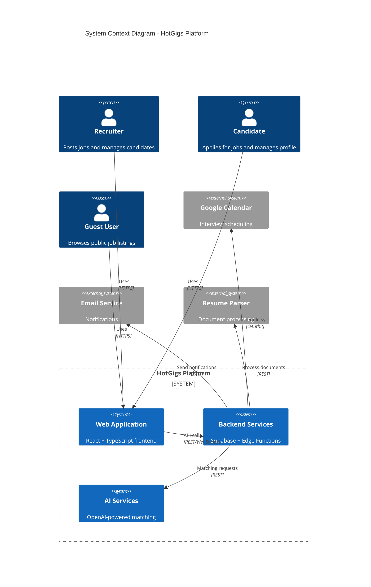

## 2.2 Container Architecture

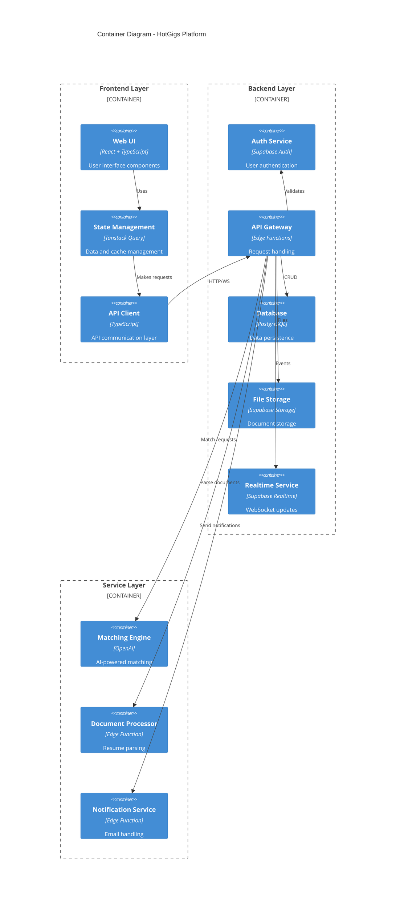

## 2.3 Component Architecture

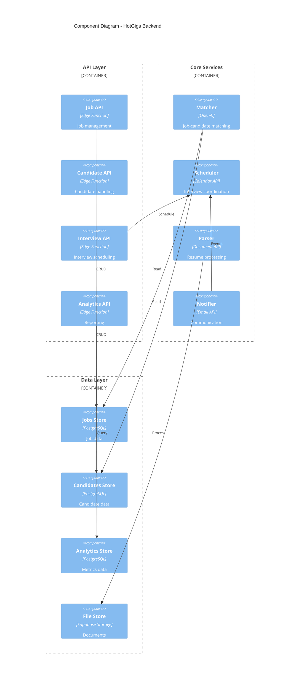

## 2.4 Technical Decisions

### 2.4.1 Architecture Style

| Decision | Rationale |
|----------|-----------|
| Hybrid Architecture | Combines monolithic frontend with service-oriented backend |
| Edge Functions | Enables serverless compute close to users |
| Event-Driven | Facilitates real-time updates and loose coupling |

### 2.4.2 Data Storage

| Component | Solution | Justification |
|-----------|----------|---------------|
| Primary Database | PostgreSQL | ACID compliance, JSON support |
| File Storage | Supabase Storage | Integrated security, CDN delivery |
| Caching | Redis | In-memory performance, pub/sub |
| Search | PostgreSQL FTS | Integrated full-text search |

### 2.4.3 Communication Patterns

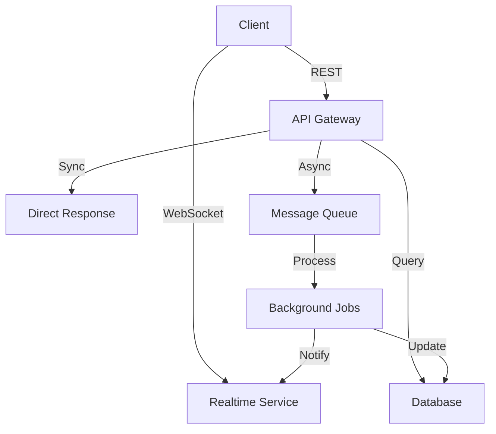

## 2.5 Cross-Cutting Concerns

### 2.5.1 Monitoring and Observability

| Layer | Implementation |
|-------|----------------|
| Metrics | Prometheus + Grafana |
| Tracing | OpenTelemetry |
| Logging | Vector + Loki |
| Alerting | PagerDuty |

### 2.5.2 Security Architecture

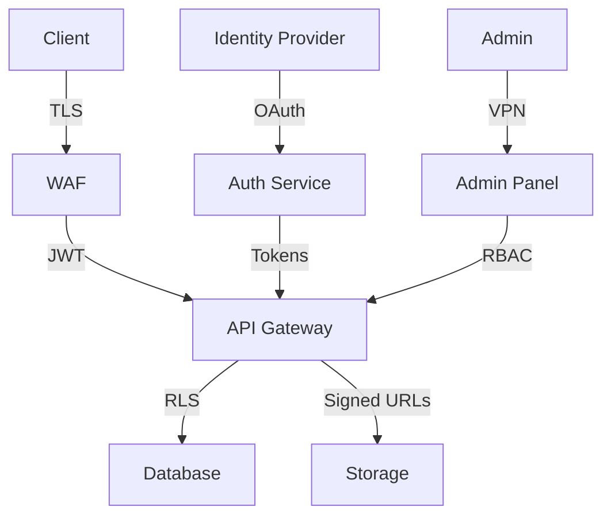

### 2.5.3 Deployment Architecture

```mermaid
C4Deployment
    title Deployment Diagram - HotGigs Platform

    Deployment_Node(cdn, "CDN", "Cloudflare") {
        Container(static, "Static Assets")
    }

    Deployment_Node(edge, "Edge Network") {
        Container(functions, "Edge Functions")
    }

    Deployment_Node(cloud, "Cloud Platform") {
        Container(app, "Web Application")
        Container(db, "Database Cluster")
        Container(cache, "Redis Cache")
        Container(storage, "Object Storage")
    }

    Rel(cdn, edge, "Route")
    Rel(edge, cloud, "Process")
```

# 3. SYSTEM COMPONENTS ARCHITECTURE

## 3.1 User Interface Design

### 3.1.1 Design System Specifications

| Component | Implementation | Details |
|-----------|---------------|----------|
| Design Framework | shadcn/ui + Tailwind CSS | Consistent component library with utility-first styling |
| Color System | CSS Variables | Dynamic theming with dark/light mode support |
| Typography | Font Scale | 8 sizes with 1.25 ratio scale |
| Spacing | 4px Base Unit | Consistent spacing with 0.25rem increments |
| Breakpoints | Mobile-First | xs(320px), sm(640px), md(768px), lg(1024px), xl(1280px) |
| Accessibility | WCAG 2.1 AA | Full keyboard navigation, ARIA labels, contrast ratios |

### 3.1.2 Layout Structure

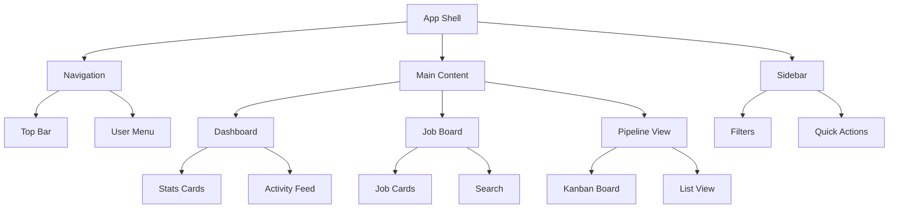

### 3.1.3 Critical User Flows

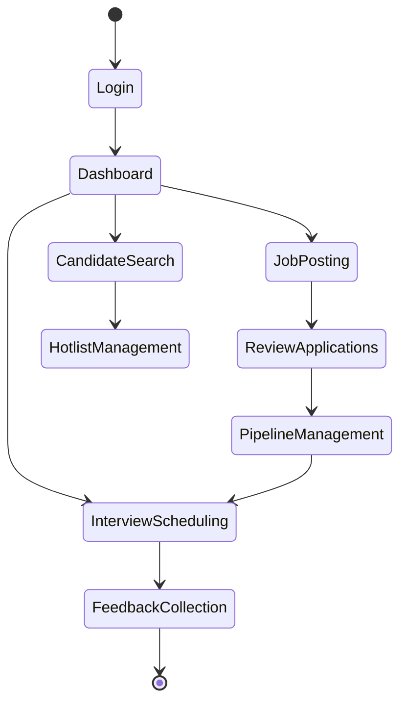

## 3.2 Database Design

### 3.2.1 Schema Design

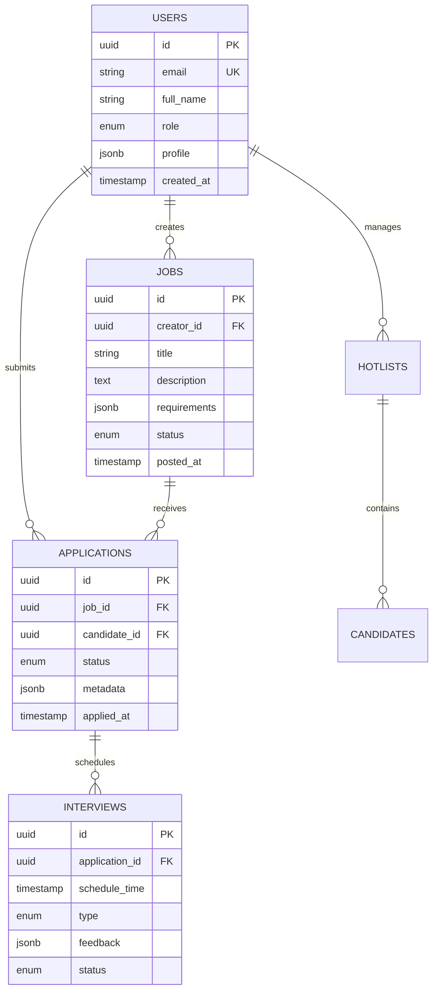

### 3.2.2 Data Management Strategy

| Aspect | Implementation | Details |
|--------|---------------|----------|
| Partitioning | Time-based | Monthly partitions for applications and interviews |
| Indexing | Composite | Optimized for common query patterns |
| Caching | Redis | 15-minute TTL for frequent queries |
| Replication | Read Replicas | 2 replicas per region |
| Backup | Daily + WAL | 30-day retention with point-in-time recovery |
| Archival | Quarterly | Move to cold storage after 1 year |

## 3.3 API Design

### 3.3.1 API Architecture

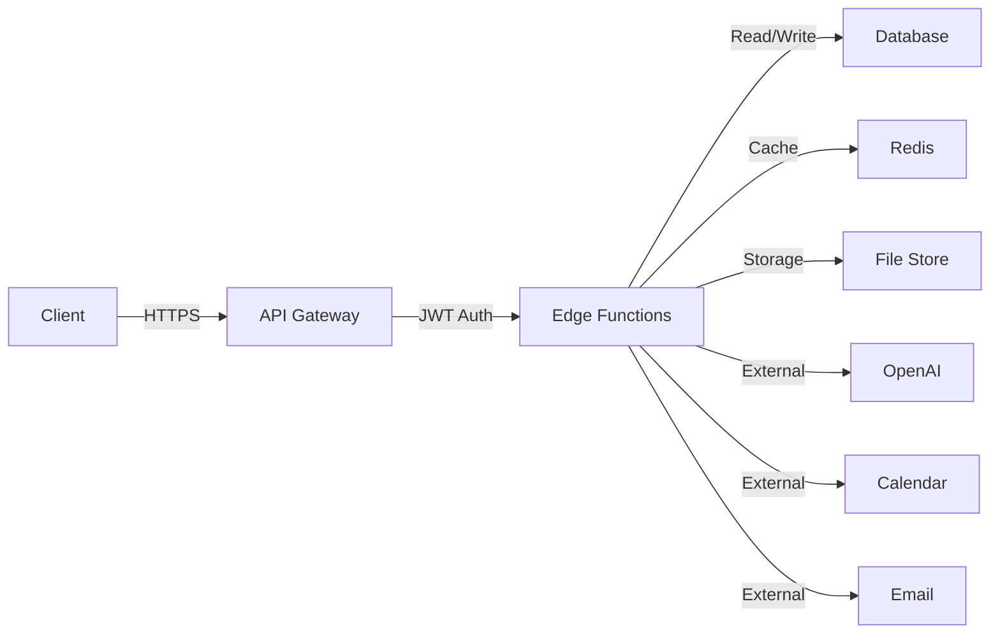

### 3.3.2 Endpoint Specifications

| Category | Endpoint | Method | Auth | Rate Limit |
|----------|----------|--------|------|------------|
| Jobs | /api/jobs | GET, POST | JWT | 1000/hr |
| Applications | /api/applications | GET, POST | JWT | 2000/hr |
| Candidates | /api/candidates | GET, POST | JWT | 1000/hr |
| Interviews | /api/interviews | GET, POST | JWT | 500/hr |
| Analytics | /api/analytics | GET | JWT | 100/hr |

### 3.3.3 Integration Patterns

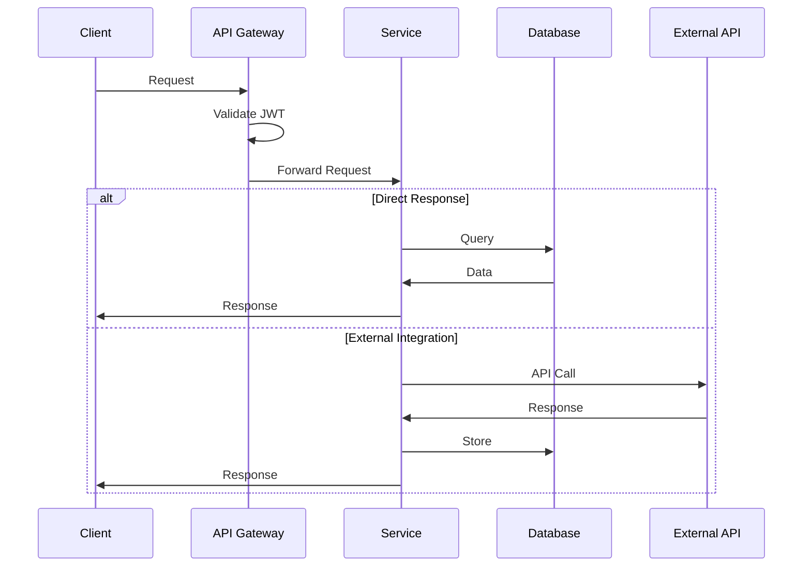

### 3.3.4 Error Handling

| Status Code | Category | Retry Strategy |
|-------------|----------|----------------|
| 4xx | Client Error | No retry |
| 429 | Rate Limit | Exponential backoff |
| 5xx | Server Error | 3 retries with backoff |
| 503 | Service Unavailable | Circuit breaker pattern |

### 3.3.5 Security Controls

| Control | Implementation | Details |
|---------|---------------|----------|
| Authentication | JWT | RS256 signing, 1-hour expiry |
| Authorization | RBAC | Role-based access policies |
| Rate Limiting | Token Bucket | Per-user and per-IP limits |
| Input Validation | JSON Schema | Request payload validation |
| Output Sanitization | Encoding | HTML/SQL injection prevention |
| API Versioning | URL Path | /v1/, /v2/ convention |

# 4. TECHNOLOGY STACK

## 4.1 PROGRAMMING LANGUAGES

| Platform | Language | Version | Justification |
|----------|----------|---------|---------------|
| Frontend | TypeScript | 5.0+ | Type safety, better IDE support, reduced runtime errors |
| Backend | TypeScript | 5.0+ | Code sharing with frontend, type consistency across stack |
| Edge Functions | TypeScript | 5.0+ | Unified language ecosystem, serverless optimization |
| Database | SQL/PLPGSQL | 14+ | Native PostgreSQL procedural language for custom functions |

## 4.2 FRAMEWORKS & LIBRARIES

### 4.2.1 Frontend Core

| Component | Technology | Version | Justification |
|-----------|------------|---------|---------------|
| Framework | React | 18.0+ | Component reusability, virtual DOM performance |
| Styling | Tailwind CSS | 3.0+ | Utility-first approach, rapid development |
| UI Components | shadcn/ui | 1.0+ | Accessible, customizable components |
| State Management | Tanstack Query | 4.0+ | Server state management, caching |
| Form Handling | React Hook Form | 7.0+ | Performance, validation capabilities |

### 4.2.2 Backend Services

| Component | Technology | Version | Justification |
|-----------|------------|---------|---------------|
| Platform | Supabase | Latest | Integrated auth, realtime, storage solutions |
| API | Edge Functions | Latest | Low latency, globally distributed compute |
| WebSocket | Supabase Realtime | Latest | Real-time updates and subscriptions |
| File Processing | Sharp | 0.32+ | High-performance image processing |

## 4.3 DATABASES & STORAGE

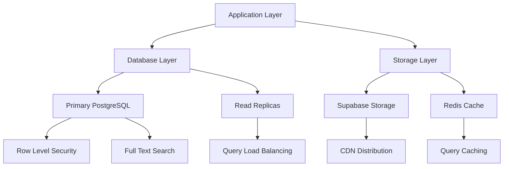

### 4.3.1 Data Storage Solutions

| Type | Technology | Purpose | Configuration |
|------|------------|---------|---------------|
| Primary Database | PostgreSQL 14+ | Core data storage | Multi-AZ deployment |
| Caching | Redis 6+ | Query/API caching | 15-minute TTL |
| File Storage | Supabase Storage | Document storage | CDN-enabled |
| Search | PostgreSQL FTS | Full-text search | GiST indexes |

## 4.4 THIRD-PARTY SERVICES

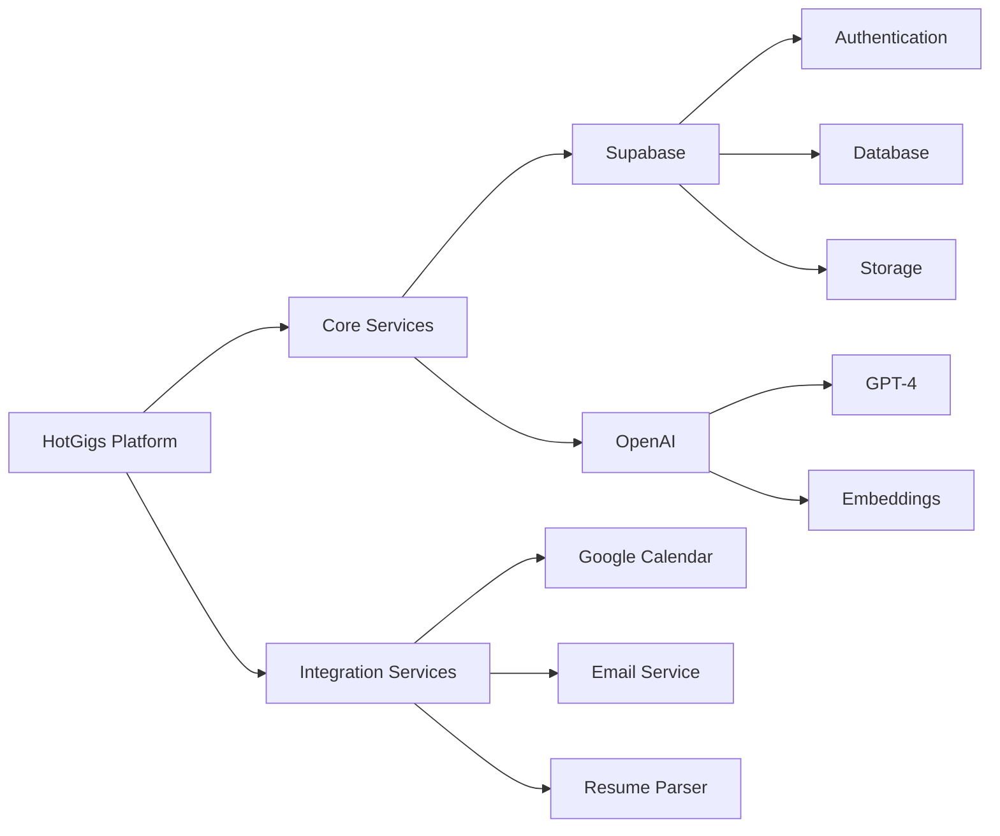

### 4.4.1 Service Integration Matrix

| Service | Purpose | Integration Method | SLA |
|---------|---------|-------------------|-----|
| OpenAI | AI matching | REST API | 99.9% |
| Google Calendar | Scheduling | OAuth 2.0 | 99.95% |
| SendGrid | Email delivery | SMTP/API | 99.99% |
| Sentry | Error tracking | SDK | 99.9% |
| DataDog | Monitoring | Agent | 99.9% |

## 4.5 DEVELOPMENT & DEPLOYMENT

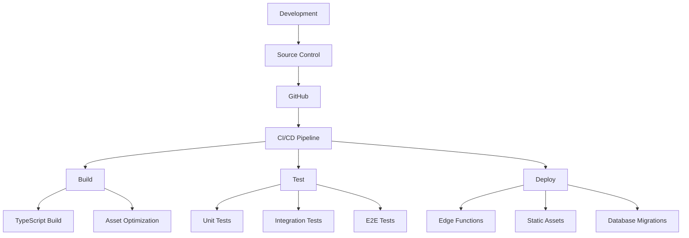

### 4.5.1 Development Environment

| Tool | Purpose | Version |
|------|---------|---------|
| VS Code | IDE | Latest |
| ESLint | Linting | 8.0+ |
| Prettier | Formatting | 3.0+ |
| Vitest | Testing | 0.34+ |
| Cypress | E2E Testing | 13.0+ |

### 4.5.2 Deployment Pipeline

| Stage | Tools | Configuration |
|-------|-------|---------------|
| Build | Vite | Production optimization |
| Testing | GitHub Actions | Automated test suite |
| Deployment | Supabase CLI | Zero-downtime updates |
| Monitoring | DataDog | Real-time metrics |

# 5. SYSTEM DESIGN

## 5.1 User Interface Design

### 5.1.1 Layout Structure

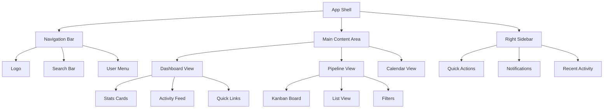

### 5.1.2 Core Components

| Component | Description | Key Features |
|-----------|-------------|--------------|
| Navigation | Top-fixed navigation bar | - Role-based menu items<br>- Global search<br>- Notifications |
| Dashboard | Main landing page | - Key metrics<br>- Recent activity<br>- Quick actions |
| Pipeline | Recruitment pipeline view | - Kanban/List toggle<br>- Stage management<br>- Drag-drop interface |
| Calendar | Interview scheduling | - Month/week views<br>- Event creation<br>- Time slots |

### 5.1.3 Responsive Design

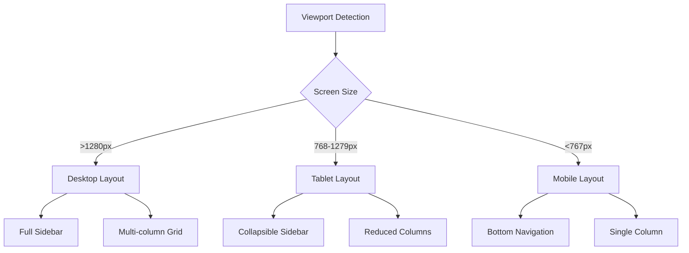

## 5.2 Database Design

### 5.2.1 Schema Design

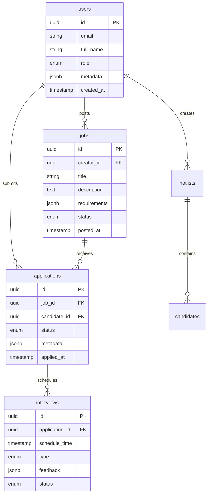

### 5.2.2 Data Management

| Aspect | Implementation | Details |
|--------|----------------|---------|
| Storage | PostgreSQL 14+ | Row-level security, JSON support |
| Indexing | B-tree + GiST | Optimized for search queries |
| Partitioning | Time-based | Monthly partitions for historical data |
| Caching | Redis | 15-minute TTL for frequent queries |
| Backups | Daily + WAL | Point-in-time recovery capability |

## 5.3 API Design

### 5.3.1 REST Endpoints

| Endpoint | Method | Purpose | Auth |
|----------|--------|---------|------|
| /api/jobs | GET, POST | Job management | JWT |
| /api/applications | GET, POST | Application handling | JWT |
| /api/candidates | GET, POST | Candidate management | JWT |
| /api/interviews | GET, POST | Interview scheduling | JWT |
| /api/analytics | GET | Reporting data | JWT |

### 5.3.2 WebSocket Events

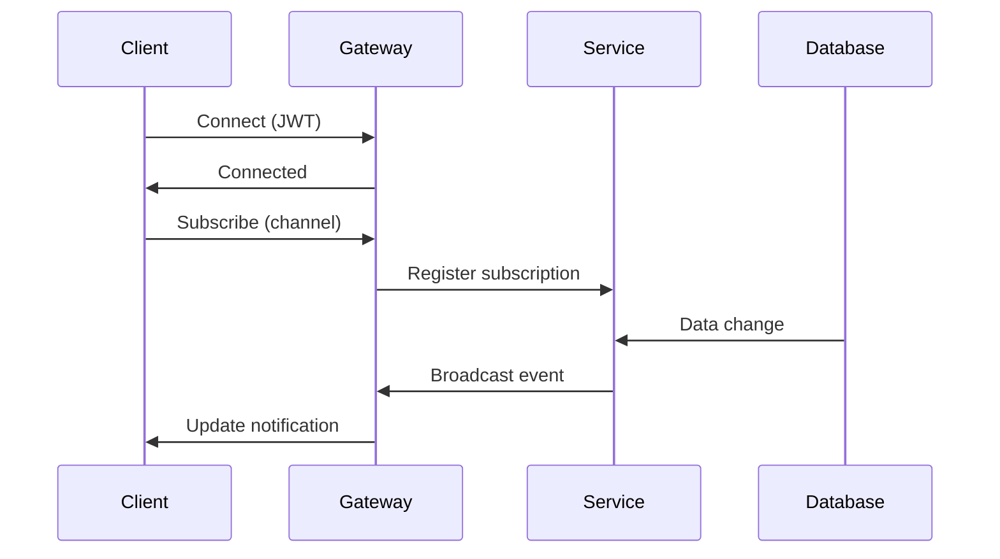

### 5.3.3 Integration Patterns

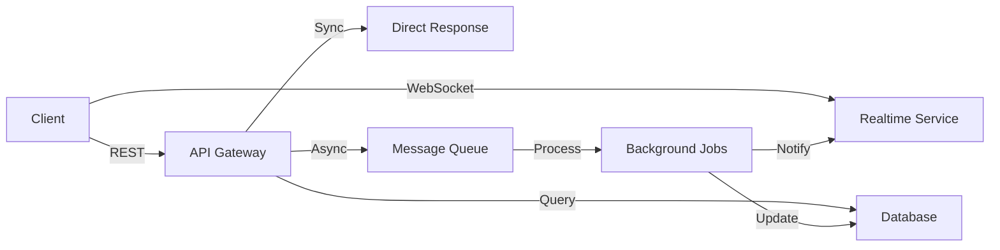

### 5.3.4 Error Handling

| Status Code | Category | Retry Strategy |
|-------------|----------|----------------|
| 4xx | Client Error | No retry |
| 429 | Rate Limit | Exponential backoff |
| 5xx | Server Error | 3 retries with backoff |
| 503 | Service Unavailable | Circuit breaker |

### 5.3.5 Security Controls

| Control | Implementation | Details |
|---------|----------------|---------|
| Authentication | JWT | RS256 signing |
| Authorization | RBAC | Role-based policies |
| Rate Limiting | Token Bucket | Per-user/IP limits |
| Input Validation | JSON Schema | Request validation |
| Output Sanitization | Encoding | XSS prevention |

# 6. USER INTERFACE DESIGN

## 6.1 Design System

The HotGigs interface follows the shadcn/ui component library with Tailwind CSS styling, implementing a consistent design system across all views.

### Icon Key
```
[#] Dashboard/Menu     [@] User/Profile    [+] Add/Create    [x] Close/Delete
[?] Help/Info         [$] Payments        [i] Information   [!] Alert/Warning
[<] Previous          [>] Next            [^] Upload        [=] Settings
[*] Favorite/Save     [v] Dropdown        [ ] Checkbox      ( ) Radio Button
```

## 6.2 Core Layouts

### 6.2.1 Main Navigation
```
+----------------------------------------------------------+
|  HotGigs [#]                                    [@] [=]   |
|----------------------------------------------------------|
| [#] Dashboard    [i] Jobs    [@] Candidates    [$] Plans  |
+----------------------------------------------------------+
```

### 6.2.2 Recruiter Dashboard
```
+----------------------------------------------------------+
| Dashboard                                     [@] John Doe |
|----------------------------------------------------------|
| Quick Stats:                                              |
| +----------------+ +----------------+ +----------------+   |
| | Active Jobs    | | Applications  | | Interviews     |   |
| | 24            | | 156           | | 12 Today       |   |
| +----------------+ +----------------+ +----------------+   |
|                                                          |
| Recent Activity                        [v] Filter        |
| +------------------------------------------------------+|
| | [i] New application for Senior Developer              ||
| | [!] Interview scheduled with Jane Smith              ||
| | [*] Candidate added to Engineering Hotlist           ||
| +------------------------------------------------------+|
|                                                          |
| Upcoming Interviews                     [+] Schedule     |
| +------------------------------------------------------+|
| | 10:00 - Technical Interview - React Developer        ||
| | 14:00 - HR Round - UX Designer                      ||
| +------------------------------------------------------+|
+----------------------------------------------------------+
```

### 6.2.3 Job Posting Interface
```
+----------------------------------------------------------+
| Create Job Posting                            [?] Help    |
|----------------------------------------------------------|
| Title: [..........................................]        |
|                                                          |
| Department: [v] Engineering                              |
| Location:   [v] Remote                                   |
|                                                          |
| Description:                                             |
| +------------------------------------------------------+|
| |                                                      ||
| | [Rich Text Editor Area]                             ||
| |                                                      ||
| +------------------------------------------------------+|
|                                                          |
| Requirements:                                            |
| [ ] Add skill requirements                               |
| +----------------+ +----------------+ +----------------+  |
| | React          | | TypeScript    | | Node.js       |  |
| | [x]            | | [x]           | | [x]           |  |
| +----------------+ +----------------+ +----------------+  |
|                                                          |
| [Save Draft]                               [Publish Job] |
+----------------------------------------------------------+
```

### 6.2.4 Candidate Pipeline View
```
+----------------------------------------------------------+
| Pipeline View                              [v] View Options|
|----------------------------------------------------------|
| +------------+ +------------+ +------------+ +------------+|
| | Applied    | | Screening  | | Interview  | | Offer     ||
| | (25)       | | (12)      | | (8)        | | (3)       ||
| +------------+ +------------+ +------------+ +------------+|
| |            | |            | |            | |            ||
| | [@] Sarah  | | [@] Mike   | | [@] Alex   | | [@] Lisa  ||
| | Developer  | | Designer   | | Engineer   | | Dev Lead  ||
| |            | |            | |            | |            ||
| | [@] James  | | [@] Emma   | | [@] David  | | [@] Tom   ||
| | QA Eng.    | | Frontend   | | Backend    | | Senior Dev||
| |            | |            | |            | |            ||
| | [+] Add    | | [+] Add    | | [+] Add    | | [+] Add   ||
| +------------+ +------------+ +------------+ +------------+|
+----------------------------------------------------------+
```

### 6.2.5 Interview Scheduler
```
+----------------------------------------------------------+
| Schedule Interview                                        |
|----------------------------------------------------------|
| Candidate: [@] Jane Smith                                 |
| Position: Senior React Developer                          |
|                                                          |
| Type: ( ) Technical  ( ) HR  ( ) Final                   |
|                                                          |
| Date: [...../..../....] Time: [....:....] [v] Timezone  |
|                                                          |
| Interviewers:                                            |
| [ ] John Doe (Technical Lead)                            |
| [ ] Sarah Wilson (HR Manager)                            |
|                                                          |
| Location: ( ) Video Call  ( ) Office  ( ) Phone          |
|                                                          |
| Notes: [...................................................|
|        ...................................................]|
|                                                          |
| [Cancel]                                [Send Invites]    |
+----------------------------------------------------------+
```

## 6.3 Responsive Behavior

The interface adapts to different screen sizes following these breakpoints:

- Mobile (320px-639px): Single column layout, collapsible navigation
- Tablet (640px-1023px): Two column layout, simplified dashboard
- Desktop (1024px+): Full featured layout with sidebars

### 6.3.1 Mobile Navigation
```
+------------------+
| HotGigs    [=]  |
|-----------------|
| [Search...]     |
|-----------------|
| + Dashboard     |
| + Jobs          |
| + Candidates    |
| + Calendar      |
| + Settings      |
+------------------+
```

## 6.4 Component States

### Loading State
```
+------------------+
|   Loading...     |
| [====    ] 60%   |
+------------------+
```

### Error State
```
+------------------+
| [!] Error        |
| Connection lost  |
| [Try Again]      |
+------------------+
```

### Success State
```
+------------------+
| [i] Success      |
| Changes saved    |
| [Continue]       |
+------------------+
```

# 7. SECURITY CONSIDERATIONS

## 7.1 Authentication and Authorization

### 7.1.1 Authentication Flow

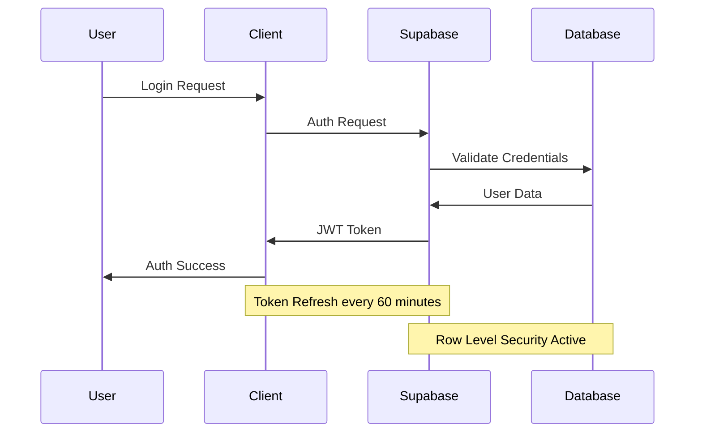

### 7.1.2 Authorization Matrix

| Role | Job Management | Candidate Access | Interview Management | Analytics | System Config |
|------|----------------|------------------|---------------------|-----------|---------------|
| Admin | Full Access | Full Access | Full Access | Full Access | Full Access |
| Recruiter | Create/Edit/Delete | View/Edit Assigned | Full Access | Limited View | No Access |
| Hiring Manager | View/Comment | View Assigned | Schedule/Feedback | Team View | No Access |
| Candidate | View Public | Own Profile Only | View/Schedule | No Access | No Access |
| Guest | View Public | No Access | No Access | No Access | No Access |

## 7.2 Data Security

### 7.2.1 Data Protection Measures

```mermaid
flowchart TD
    A[Data Input] -->|TLS 1.3| B[Edge Security]
    B -->|Validation| C[Application Layer]
    C -->|RLS| D[Database Layer]
    
    D -->|Encryption| E[Data at Rest]
    D -->|Audit| F[Logging System]
    
    B -->|WAF Rules| G[Security Controls]
    G -->|Block| H[Threats]
    G -->|Allow| C
    
    E -->|AES-256| I[Stored Data]
    F -->|Encrypted| J[Audit Logs]
```

### 7.2.2 Data Classification

| Data Type | Classification | Protection Level | Encryption | Access Control |
|-----------|---------------|------------------|------------|----------------|
| User Credentials | Critical | Highest | Hash + Salt | Auth Only |
| PII Data | Sensitive | High | AES-256 | RLS + Auth |
| Resume Data | Confidential | High | AES-256 | RLS + Auth |
| Job Postings | Internal | Medium | In-Transit | Role-Based |
| Public Content | Public | Low | In-Transit | None |

## 7.3 Security Protocols

### 7.3.1 Network Security

| Layer | Implementation | Details |
|-------|---------------|----------|
| Edge | Cloudflare WAF | DDoS protection, threat blocking |
| Transport | TLS 1.3 | Secure communication channel |
| API | Rate Limiting | 1000 requests/minute per IP |
| Database | Connection Pooling | Max 100 concurrent connections |
| Storage | Signed URLs | 15-minute expiration |

### 7.3.2 Security Monitoring

```mermaid
flowchart LR
    A[Security Events] -->|Real-time| B[Monitoring System]
    B -->|Alerts| C[Security Team]
    B -->|Logs| D[DataDog]
    
    D -->|Analysis| E[Security Dashboard]
    D -->|Storage| F[Log Archive]
    
    C -->|Response| G[Incident Management]
    G -->|Updates| H[Security Policies]
    
    B -->|Metrics| I[Performance Monitor]
    I -->|Anomalies| C
```

### 7.3.3 Compliance Controls

| Requirement | Implementation | Validation |
|-------------|---------------|------------|
| GDPR | Data encryption, consent management | Quarterly audit |
| CCPA | Data access controls, deletion capability | Annual review |
| SOC 2 | Security monitoring, access logging | External audit |
| HIPAA | Data isolation, access tracking | Compliance check |

### 7.3.4 Security Response Plan

```mermaid
stateDiagram-v2
    [*] --> Monitoring
    Monitoring --> Detection: Security Event
    Detection --> Assessment: Trigger Alert
    Assessment --> Response: Threat Confirmed
    Response --> Mitigation: Action Required
    Mitigation --> Recovery: Threat Contained
    Recovery --> Analysis: System Restored
    Analysis --> Updates: Lessons Learned
    Updates --> Monitoring: Implementation
```

### 7.3.5 Access Control Implementation

| Control Type | Method | Description |
|--------------|--------|-------------|
| Authentication | JWT + MFA | Time-based tokens with 2FA requirement |
| Session Management | Redis | 30-minute session timeout |
| API Security | OAuth 2.0 | Secure third-party integrations |
| File Access | Presigned URLs | Temporary access to stored files |
| Database Access | RLS Policies | Row-level security enforcement |

# 8. INFRASTRUCTURE

## 8.1 Deployment Environment

```mermaid
flowchart TD
    A[Production Environment] --> B[Edge Network]
    A --> C[Cloud Platform]
    
    B --> D[Cloudflare]
    D --> E[Edge Functions]
    D --> F[CDN Cache]
    
    C --> G[Supabase Platform]
    G --> H[PostgreSQL]
    G --> I[Storage]
    G --> J[Auth]
    
    C --> K[Monitoring]
    K --> L[DataDog]
    K --> M[Sentry]
```

| Environment | Purpose | Configuration |
|-------------|---------|---------------|
| Development | Local development and testing | Docker containers on developer machines |
| Staging | Pre-production testing | Dedicated Supabase project with production mirror |
| Production | Live system | Multi-region Supabase deployment with edge functions |
| DR | Disaster recovery | Cross-region replication with automated failover |

## 8.2 Cloud Services

| Service | Provider | Purpose | Justification |
|---------|----------|---------|---------------|
| Database | Supabase | Primary data store | Built-in RLS, real-time capabilities |
| Edge Functions | Supabase | Serverless compute | Low latency, auto-scaling |
| Storage | Supabase Storage | File storage | Integrated with RLS, CDN delivery |
| CDN | Cloudflare | Content delivery | Global edge network, DDoS protection |
| Monitoring | DataDog | System monitoring | Comprehensive observability |
| Error Tracking | Sentry | Error reporting | Detailed error context, source maps |

## 8.3 Containerization

```mermaid
flowchart LR
    A[Application] --> B[Container Registry]
    B --> C[Container Images]
    
    C --> D[Frontend Image]
    C --> E[Edge Function Images]
    
    D --> F[React App]
    E --> G[API Functions]
    
    F --> H[NGINX]
    G --> I[Node.js Runtime]
```

### Container Specifications

| Component | Base Image | Size | Configuration |
|-----------|------------|------|---------------|
| Frontend | node:18-alpine | <100MB | Multi-stage build with NGINX |
| Edge Functions | node:18-alpine | <50MB | Minimal runtime dependencies |
| Development | node:18 | <1GB | Full development tools included |

## 8.4 Orchestration

```mermaid
flowchart TD
    A[Deployment Controller] --> B[Edge Network]
    A --> C[Static Assets]
    
    B --> D[Region 1]
    B --> E[Region 2]
    B --> F[Region 3]
    
    D --> G[Edge Function Pool]
    E --> H[Edge Function Pool]
    F --> I[Edge Function Pool]
    
    C --> J[CDN Distribution]
    J --> K[Global Edge Cache]
```

| Component | Management | Scale Units |
|-----------|------------|-------------|
| Edge Functions | Automatic scaling | 1-1000 instances |
| Static Assets | CDN replication | Global edge locations |
| Database | Managed scaling | 2-8 nodes |
| Cache | Auto-scaling | 1-4 nodes per region |

## 8.5 CI/CD Pipeline

```mermaid
flowchart LR
    A[Source Code] --> B[GitHub Actions]
    
    B --> C[Build]
    C --> D[Test]
    D --> E[Security Scan]
    
    E --> F{Branch?}
    F -->|main| G[Production Deploy]
    F -->|staging| H[Staging Deploy]
    F -->|feature| I[Preview Deploy]
    
    G --> J[Edge Functions]
    G --> K[Static Assets]
    G --> L[Database Migrations]
    
    J --> M[Health Check]
    K --> M
    L --> M
```

### Pipeline Stages

| Stage | Tools | Actions |
|-------|-------|---------|
| Build | Vite, TypeScript | Compile, bundle, optimize |
| Test | Vitest, Cypress | Unit, integration, E2E tests |
| Security | Snyk, SonarQube | Vulnerability scanning, code quality |
| Deploy | Supabase CLI, Cloudflare | Zero-downtime deployment |
| Verify | DataDog, Sentry | Health checks, monitoring |

### Deployment Strategy

| Type | Strategy | Rollback Time |
|------|----------|---------------|
| Frontend | Blue-green deployment | <1 minute |
| Edge Functions | Rolling updates | <2 minutes |
| Database | Migration with reversion | <5 minutes |
| Configuration | Versioned changes | Immediate |

# APPENDICES

## A.1 Additional Technical Information

### A.1.1 Resume Processing Specifications

| Feature | Specification |
|---------|--------------|
| Supported Formats | PDF, DOC, DOCX, RTF, TXT |
| Maximum File Size | 10MB per file |
| Bulk Import | Up to 1M resumes via API |
| Processing Time | <5s per document |
| Extraction Fields | - Contact Information<br>- Work History<br>- Education<br>- Skills<br>- Certifications<br>- Languages |
| Storage Format | JSONB in PostgreSQL |
| Retention Period | 5 years with archival |

### A.1.2 Email Template System

```mermaid
flowchart TD
    A[Template System] --> B[Template Types]
    B --> C[Interview]
    B --> D[Status Update]
    B --> E[Reminders]
    
    A --> F[Components]
    F --> G[Dynamic Variables]
    F --> H[HTML/Text Versions]
    F --> I[Localization]
    
    A --> J[Delivery]
    J --> K[SMTP]
    J --> L[API]
    J --> M[Queue]
```

### A.1.3 AI Model Integration

| Component | Implementation |
|-----------|---------------|
| Text Embeddings | OpenAI Ada-002 |
| Matching Algorithm | Cosine Similarity |
| Skills Extraction | GPT-4 with Custom Prompt |
| Resume Analysis | Zero-shot Classification |
| Job Categorization | Fine-tuned GPT Model |

## A.2 Glossary

| Term | Definition |
|------|------------|
| Hotlist | Curated list of potential candidates for future opportunities |
| Pipeline | Sequential stages in the recruitment process |
| Talent Pool | Shared database of candidates across recruiter network |
| Match Score | AI-generated compatibility percentage between candidate and job |
| Edge Function | Serverless function running on distributed edge network |
| Row Level Security | Database security controlling row access based on user context |
| Realtime | Live data synchronization feature of Supabase |
| Hotgigs Admin | Managed service provider role for system administration |
| Presigned URL | Temporary secure URL for file access |
| Circuit Breaker | Pattern to prevent cascading system failures |

## A.3 Acronyms

| Acronym | Full Form |
|---------|-----------|
| API | Application Programming Interface |
| RBAC | Role-Based Access Control |
| JWT | JSON Web Token |
| RLS | Row Level Security |
| SMTP | Simple Mail Transfer Protocol |
| CDN | Content Delivery Network |
| WCAG | Web Content Accessibility Guidelines |
| SLA | Service Level Agreement |
| PII | Personally Identifiable Information |
| MTBF | Mean Time Between Failures |
| MTTR | Mean Time To Recovery |
| WAF | Web Application Firewall |
| TLS | Transport Layer Security |
| AES | Advanced Encryption Standard |
| GDPR | General Data Protection Regulation |
| CCPA | California Consumer Privacy Act |
| TTL | Time To Live |
| RPO | Recovery Point Objective |
| RTO | Recovery Time Objective |
| OAuth | Open Authorization |