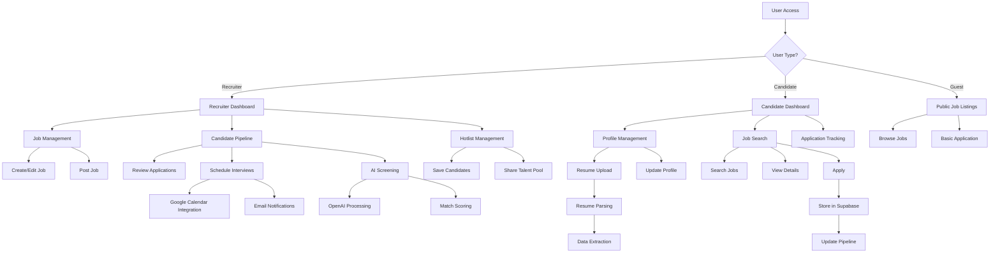
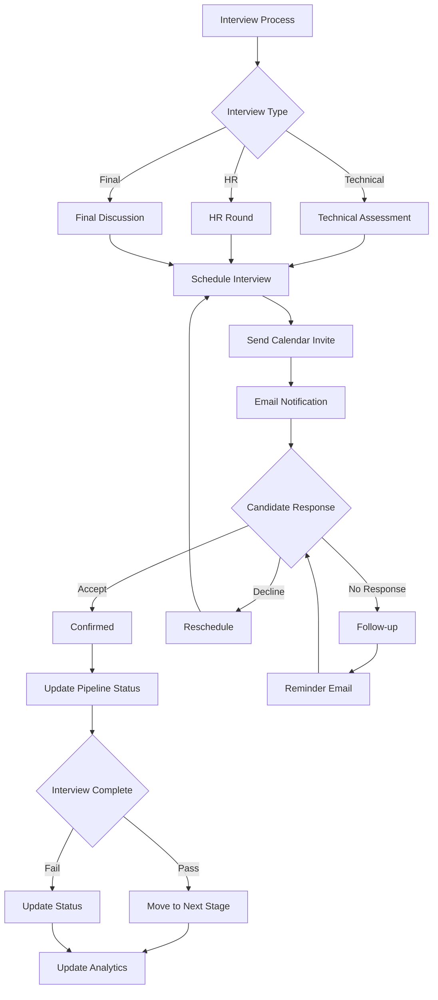
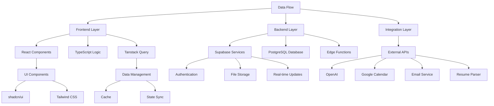
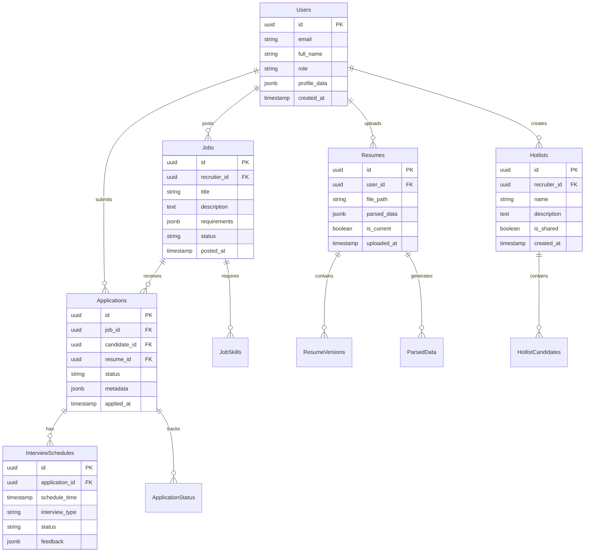
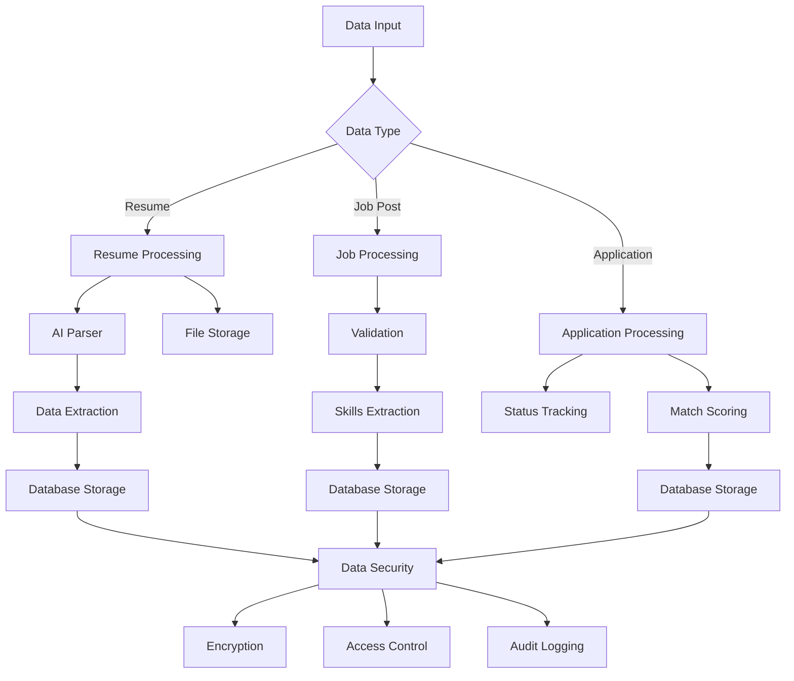
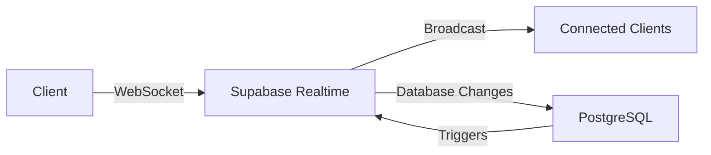

# Product Requirements Document (PRD)

# 1. INTRODUCTION

## 1.1 Purpose

This Software Requirements Specification (SRS) document provides a comprehensive description of the HotGigs recruitment management system. It details the functional and non-functional requirements for developers, project managers, QA teams, and stakeholders involved in the development and deployment of the platform. This document serves as the primary reference for technical implementation and validation of the system requirements.

## 1.2 Scope

HotGigs is an advanced recruitment management system designed to streamline the hiring process through AI-powered matching and comprehensive workflow management. The system encompasses:

### Core Functionalities

- AI-driven candidate-job matching system
- Multi-user recruitment pipeline management
- Automated resume parsing and data extraction
- Interview scheduling and calendar management
- Talent pool sharing and hotlist management
- Advanced analytics and reporting
- Application hotgigs admin Act as Managed services provider 

### Key Benefits

- Reduced time-to-hire through AI-assisted screening
- Improved candidate matching accuracy
- Enhanced collaboration through shared talent pools
- Streamlined interview scheduling process
- Centralized candidate data management
- Comprehensive recruitment analytics

### System Boundaries

- Frontend web application built with React and TypeScript
- Backend services powered by Supabase
- Integration with external services:
  - OpenAI for AI-powered features
  - Google Calendar for scheduling
  - Email service providers
  - Resume parsing services

### User Categories

- Recruiters: Full system access with management capabilities
- Candidates: Profile and application management
- Guests: Limited access to public job listings

# 2. PRODUCT DESCRIPTION

## 2.1 Product Perspective

HotGigs operates as a standalone web-based recruitment management system that integrates with several external services to provide comprehensive recruitment functionality. The system architecture consists of:

- Frontend Layer: React/TypeScript application serving the user interface
- Backend Layer: Supabase-powered services handling data and business logic
- Integration Layer: Connections to third-party services
  - OpenAI API for AI-powered matching
  - Google Calendar API for scheduling
  - Email service providers for notifications
  - Resume parsing services for document processing

## 2.2 Product Functions

The primary functions of HotGigs include:

1. AI-Powered Recruitment

   - Intelligent candidate-job matching
   - Automated resume parsing and data extraction
   - Smart candidate recommendations

2. Recruitment Pipeline Management

   - End-to-end application tracking
   - Multi-stage interview management
   - Collaborative candidate evaluation

3. Talent Pool Management

   - Shared candidate databases
   - Hotlist creation and management
   - Network-wide talent sharing

4. Interview Coordination

   - Automated scheduling system
   - Calendar integration
   - Email notifications
   - Interview feedback collection

5. Analytics and Reporting

   - Recruitment metrics dashboard
   - Performance analytics
   - Custom report generation

## 2.3 User Characteristics

### Recruiters

- Technical proficiency: Intermediate
- Usage frequency: Daily
- Key needs: Efficient candidate management, quick screening, collaboration tools
- Access level: Full system access
- Typical activities: Posting jobs, screening candidates, scheduling interviews

### Candidates

- Technical proficiency: Basic to Advanced
- Usage frequency: Periodic
- Key needs: Easy application process, profile management, application tracking
- Access level: Limited to personal profile and applications
- Typical activities: Profile updates, job applications, interview scheduling

### Guests

- Technical proficiency: Basic
- Usage frequency: Occasional
- Key needs: Job search, basic application submission
- Access level: Public job listings only
- Typical activities: Browsing jobs, initial applications

## 2.4 Constraints

1. Technical Constraints

   - Supabase platform limitations
   - API rate limits for external services
   - Browser compatibility requirements
   - Mobile responsiveness requirements

2. Business Constraints

   - Data privacy compliance (GDPR, CCPA)
   - Industry-specific recruitment regulations
   - Storage limitations for resumes and documents
   - Concurrent user capacity

3. Security Constraints

   - Authentication requirements
   - Data encryption standards
   - Access control policies
   - File upload restrictions

## 2.5 Assumptions and Dependencies

### Assumptions

1. Users have stable internet connectivity
2. Browsers support modern web standards
3. External APIs maintain current service levels
4. Users have basic computer literacy
5. Resume formats are standard and parseable

### Dependencies

1. External Services

   - Supabase platform availability
   - OpenAI API functionality
   - Google Calendar API access
   - Email service provider reliability
   - Resume parsing service uptime

2. Technical Dependencies

   - React and TypeScript ecosystem
   - Tailwind CSS framework
   - shadcn/ui component library
   - Tanstack Query functionality
   - PostgreSQL database system

3. Infrastructure Dependencies

   - Cloud hosting services
   - CDN availability
   - Database backup systems
   - SSL certificate maintenance

# 3. PROCESS FLOWCHART







# 4. FUNCTIONAL REQUIREMENTS

## 4.1 Job Management

### ID: F-JM-001

### Description

Comprehensive job posting and management system allowing recruiters to create, edit, and manage job listings.

### Priority: High

### Requirements

| ID | Requirement | Description | Priority |
| --- | --- | --- | --- |
| JM-1 | Job Creation | Recruiters can create job posts with title, description, requirements, and benefits | High |
| JM-2 | Job Editing | Allow modification of job details after posting | High |
| JM-3 | Job Status Management | Toggle job visibility (active/inactive/draft) | Medium |
| JM-4 | Job Templates | Save and reuse job posting templates | Low |
| JM-5 | Job Duplication | Clone existing job posts for similar positions | Medium |

## 4.2 AI-Powered Matching

### ID: F-AI-001

### Description

Intelligent candidate-job matching system using OpenAI integration for automated screening and recommendations.

### Priority: High

### Requirements

| ID | Requirement | Description | Priority |
| --- | --- | --- | --- |
| AI-1 | Resume Parsing | Automated extraction of candidate information from resumes | High |
| AI-2 | Skill Matching | AI-based matching of candidate skills to job requirements | High |
| AI-3 | Candidate Scoring | Generate match percentage between candidates and jobs | High |
| AI-4 | Smart Recommendations | Suggest relevant candidates for open positions | Medium |
| AI-5 | Keyword Analysis | Extract and analyze key terms from resumes and job descriptions | Medium |

## 4.3 Pipeline Management

### ID: F-PM-001

### Description

End-to-end recruitment pipeline tracking and management system.

### Priority: High

### Requirements

| ID | Requirement | Description | Priority |
| --- | --- | --- | --- |
| PM-1 | Stage Management | Configure and manage recruitment pipeline stages | High |
| PM-2 | Candidate Tracking | Track candidate progress through pipeline stages | High |
| PM-3 | Status Updates | Update candidate status with notes and feedback | High |
| PM-4 | Bulk Actions | Perform actions on multiple candidates simultaneously | Medium |
| PM-5 | Pipeline Analytics | Track metrics for each pipeline stage | Medium |

## 4.4 Interview Management

### ID: F-IM-001

### Description

Comprehensive interview scheduling and feedback system with calendar integration.

### Priority: High

### Requirements

| ID | Requirement | Description | Priority |
| --- | --- | --- | --- |
| IM-1 | Schedule Creation | Create interview slots with Google Calendar integration | High |
| IM-2 | Automated Notifications | Send automated email notifications for interviews | High |
| IM-3 | Feedback Collection | Collect and store interviewer feedback | High |
| IM-4 | Schedule Management | Manage interview schedules and reschedule if needed | Medium |
| IM-5 | Interview Types | Support different types of interviews (technical, HR, final) | Medium |

## 4.5 Talent Pool Management

### ID: F-TP-001

### Description

Shared talent pool system for managing and sharing candidate databases.

### Priority: Medium

### Requirements

| ID | Requirement | Description | Priority |
| --- | --- | --- | --- |
| TP-1 | Candidate Database | Store and manage candidate profiles | High |
| TP-2 | Hotlist Creation | Create and manage lists of potential candidates | High |
| TP-3 | Network Sharing | Share candidates within recruiter networks | Medium |
| TP-4 | Talent Search | Advanced search functionality for candidate database | Medium |
| TP-5 | Candidate Tagging | Tag and categorize candidates | Low |

## 4.6 Analytics and Reporting

### ID: F-AR-001

### Description

Comprehensive analytics dashboard and reporting system.

### Priority: Medium

### Requirements

| ID | Requirement | Description | Priority |
| --- | --- | --- | --- |
| AR-1 | Recruitment Metrics | Track key recruitment metrics and KPIs | High |
| AR-2 | Custom Reports | Generate customized reports | Medium |
| AR-3 | Data Visualization | Visual representation of recruitment data | Medium |
| AR-4 | Export Functions | Export reports in various formats | Low |
| AR-5 | Performance Tracking | Track recruiter and team performance metrics | Medium |

## 4.7 Profile Management

### ID: F-PR-001

### Description

User profile management system for both recruiters and candidates.

### Priority: High

### Requirements

| ID | Requirement | Description | Priority |
| --- | --- | --- | --- |
| PR-1 | Profile Creation | Create and manage user profiles | High |
| PR-2 | Resume Management | Upload and manage multiple resume versions | High |
| PR-3 | Portfolio Management | Manage candidate portfolios and work samples | Medium |
| PR-4 | Profile Privacy | Control profile visibility settings | Medium |
| PR-5 | Profile Updates | Track and manage profile update history | Low |

# 5. NON-FUNCTIONAL REQUIREMENTS

## 5.1 Performance Requirements

| Requirement | Description | Target Metric |
| --- | --- | --- |
| Response Time | Maximum time for page loads and API responses | \< 2 seconds |
| API Latency | Maximum latency for API endpoints | \< 500ms |
| Database Queries | Maximum query execution time | \< 200ms |
| Resume Parsing | Maximum processing time per resume | \< 5 seconds |
| Concurrent Users | Minimum number of simultaneous users supported | 10,000 |
| File Upload | Maximum time for resume upload and processing | \< 10 seconds |
| Search Results | Maximum time to return search results | \< 1 second |
| Real-time Updates | Maximum delay for real-time data synchronization | \< 2 seconds |

## 5.2 Safety Requirements

| Requirement | Description |
| --- | --- |
| Data Backup | Automated daily backups with 30-day retention |
| Failover | Automatic failover to secondary systems within 5 minutes |
| Data Recovery | Recovery Point Objective (RPO) of 1 hour |
| System Recovery | Recovery Time Objective (RTO) of 4 hours |
| Error Handling | Graceful degradation of services during partial outages |
| Data Validation | Input validation for all user-submitted data |
| Session Management | Automatic session timeout after 30 minutes of inactivity |
| Audit Logging | Comprehensive logging of all system activities and changes |

## 5.3 Security Requirements

| Requirement | Description |
| --- | --- |
| Authentication | Multi-factor authentication support for user accounts |
| Authorization | Role-based access control (RBAC) with granular permissions |
| Data Encryption | AES-256 encryption for data at rest |
| Transport Security | TLS 1.3 for all data in transit |
| Password Policy | Minimum 12 characters with complexity requirements |
| API Security | OAuth 2.0 and JWT for API authentication |
| File Security | Virus scanning for all uploaded files |
| Access Logging | Detailed logs of all system access attempts |

## 5.4 Quality Requirements

### 5.4.1 Availability

- System uptime: 99.9% excluding planned maintenance
- Planned maintenance windows: Maximum 4 hours monthly
- Maximum unplanned downtime: 43.8 minutes/month

### 5.4.2 Maintainability

- Code coverage: Minimum 80%
- Documentation: Comprehensive API and code documentation
- Modular architecture: Independent service components
- Version control: Git with feature branch workflow

### 5.4.3 Usability

- Mobile responsiveness: All features accessible on devices ≥320px width
- Accessibility: WCAG 2.1 Level AA compliance
- Browser support: Latest two versions of major browsers
- Error messages: Clear, actionable user feedback

### 5.4.4 Scalability

- Horizontal scaling: Support for multiple application instances
- Database scaling: Support for read replicas and sharding
- Storage scaling: Automatic storage expansion up to 1TB
- API rate limiting: 1000 requests per minute per user

### 5.4.5 Reliability

- Mean Time Between Failures (MTBF): \>720 hours
- Mean Time To Recovery (MTTR): \<4 hours
- Error rate: \<0.1% of all requests
- Data consistency: Eventually consistent within 2 seconds

## 5.5 Compliance Requirements

| Requirement | Description |
| --- | --- |
| Data Privacy | GDPR and CCPA compliance for data handling |
| Data Retention | Configurable retention policies per data type |
| Audit Trail | Complete audit trail for all data modifications |
| Data Portability | Export functionality for all user data |
| Cookie Compliance | Cookie consent and management system |
| Accessibility | ADA and Section 508 compliance |
| Employment Law | Compliance with recruitment-specific regulations |
| Data Location | Data residency options for different regions |

# 6. DATA REQUIREMENTS

## 6.1 Data Models



## 6.2 Data Storage

### 6.2.1 Primary Storage

- PostgreSQL database hosted on Supabase
- Structured data stored in normalized tables
- JSON/JSONB columns for flexible metadata storage
- File storage for resumes and documents using Supabase Storage

### 6.2.2 Data Retention

| Data Type | Retention Period | Archive Policy |
| --- | --- | --- |
| User Profiles | Indefinite | None |
| Job Postings | 2 years | Archive after expiry |
| Applications | 3 years | Archive after 1 year |
| Resumes | 5 years | Archive after 2 years |
| Interview Data | 2 years | Archive after 1 year |
| System Logs | 1 year | Archive after 3 months |

### 6.2.3 Backup Strategy

- Real-time replication to standby database
- Daily full backups with 30-day retention
- Point-in-time recovery capability
- Geographic redundancy across multiple regions
- Automated backup verification

## 6.3 Data Processing



### 6.3.1 Data Security Measures

| Security Layer | Implementation |
| --- | --- |
| Encryption at Rest | AES-256 encryption |
| Transport Security | TLS 1.3 |
| Access Control | Row Level Security (RLS) |
| API Security | JWT authentication |
| File Security | Signed URLs with expiration |
| Data Masking | PII redaction in logs |

### 6.3.2 Data Processing Requirements

| Process | SLA | Scale |
| --- | --- | --- |
| Resume Parsing | \< 5 seconds | 1000/hour |
| Job Matching | \< 2 seconds | 5000/hour |
| Search Queries | \< 1 second | 10000/hour |
| File Upload | \< 10 seconds | 500/hour |
| Analytics Processing | \< 30 seconds | 100/hour |

### 6.3.3 Data Validation Rules

- Email format validation
- Phone number standardization
- Required field checks
- File type restrictions
- Size limits for uploads
- Data format consistency
- Duplicate detection
- Input sanitization

# 7. EXTERNAL INTERFACES

## 7.1 User Interfaces

### 7.1.1 General Requirements

- Responsive design supporting viewport widths from 320px to 4K
- WCAG 2.1 Level AA compliance
- Dark/light theme support
- Consistent shadcn/ui component styling
- Loading states for all async operations

### 7.1.2 Core Interface Components

| Component | Description | Key Features |
| --- | --- | --- |
| Navigation Bar | Primary navigation component | - Role-based menu items<br>- User profile dropdown<br>- Quick search |
| Dashboard | Role-specific landing page | - Activity feed<br>- Quick actions<br>- Key metrics |
| Job Board | Job listing interface | - Filter panel<br>- Card/list view toggle<br>- Infinite scroll |
| Candidate Pipeline | Kanban-style board | - Drag-and-drop<br>- Stage customization<br>- Quick actions |
| Calendar View | Interview schedule interface | - Month/week/day views<br>- Event creation<br>- Time zone support |

### 7.1.3 Responsive Breakpoints

| Breakpoint | Width | Target Devices |
| --- | --- | --- |
| xs | 320px | Mobile phones |
| sm | 640px | Large phones |
| md | 768px | Tablets |
| lg | 1024px | Laptops |
| xl | 1280px | Desktops |
| 2xl | 1536px | Large displays |

## 7.2 Software Interfaces

### 7.2.1 External Service Integration

| Service | Purpose | Integration Method |
| --- | --- | --- |
| OpenAI API | AI-powered matching | REST API with JWT |
| Google Calendar | Interview scheduling | OAuth 2.0 + REST API |
| Email Service | Notifications | SMTP/REST API |
| Resume Parser | Document processing | REST API |
| Supabase | Backend services | Client library |

### 7.2.2 API Specifications

```typescript
interface ExternalAPIs {
  openai: {
    endpoint: 'https://api.openai.com/v1',
    version: '1.0.0',
    auth: 'Bearer token',
    rateLimit: 100
  },
  calendar: {
    endpoint: 'https://www.googleapis.com/calendar/v3',
    auth: 'OAuth 2.0',
    scope: ['calendar.events', 'calendar.readonly']
  },
  email: {
    smtp: 'smtp.provider.com',
    port: 587,
    encryption: 'TLS'
  }
}
```

## 7.3 Communication Interfaces

### 7.3.1 Network Requirements

| Protocol | Usage | Port |
| --- | --- | --- |
| HTTPS | Web application | 443 |
| WSS | Real-time updates | 443 |
| SMTP | Email delivery | 587 |

### 7.3.2 Data Exchange Formats

| Format | Usage |
| --- | --- |
| JSON | API responses |
| JWT | Authentication tokens |
| Base64 | File transfers |
| RFC5322 | Email formatting |

### 7.3.3 Real-time Communication



### 7.3.4 Integration Protocols

| Integration | Protocol | Security |
| --- | --- | --- |
| API Calls | REST/HTTPS | JWT + API Keys |
| File Upload | HTTPS | Signed URLs |
| Real-time | WebSocket | JWT |
| Calendar Sync | OAuth 2.0 | Access Tokens |
| Email | SMTP/TLS | DKIM/SPF |

# 8. APPENDICES

## 8.1 Additional Information

### 8.1.1 Resume Parsing Specifications

- Supported file formats: PDF, DOC, DOCX
- Extractable fields:
  - Personal information (name, contact details)
  - Work experience
  - Education history
  - Skills and certifications
  - Languages
- Bulk import capability: Up to 1 million resumes
- Storage format: Parsed data stored in JSONB columns

### 8.1.2 Email Template System

- Customizable templates for:
  - Interview invitations
  - Application status updates
  - Profile completions
  - Scheduling confirmations
  - Reminder notifications
- Support for dynamic variables
- HTML and plain text versions

## 8.2 Glossary

| Term | Definition |
| --- | --- |
| Hotlist | A curated list of potential candidates saved by recruiters for future opportunities |
| Pipeline | The sequential stages a candidate moves through during the recruitment process |
| Talent Pool | A shared database of candidates accessible across the recruiter network |
| Match Score | AI-generated compatibility percentage between a candidate and job posting |
| Row Level Security (RLS) | Database security mechanism controlling row access based on user context |
| Edge Function | Serverless functions running on edge servers for custom backend logic |

## 8.3 Acronyms

| Acronym | Full Form |
| --- | --- |
| API | Application Programming Interface |
| RBAC | Role-Based Access Control |
| JWT | JSON Web Token |
| RLS | Row Level Security |
| SMTP | Simple Mail Transfer Protocol |
| WCAG | Web Content Accessibility Guidelines |
| SLA | Service Level Agreement |
| PII | Personally Identifiable Information |
| MTBF | Mean Time Between Failures |
| MTTR | Mean Time To Recovery |

## 8.4 Additional References

| Resource | Description | URL |
| --- | --- | --- |
| Supabase Documentation | Official documentation for Supabase services | https://supabase.com/docs |
| shadcn/ui Components | UI component library documentation | https://ui.shadcn.com |
| Tanstack Query | Data-fetching library documentation | https://tanstack.com/query |
| OpenAI API | AI integration documentation | https://platform.openai.com/docs |
| Google Calendar API | Calendar integration documentation | https://developers.google.com/calendar |
| Tailwind CSS | Utility-first CSS framework documentation | https://tailwindcss.com/docs |