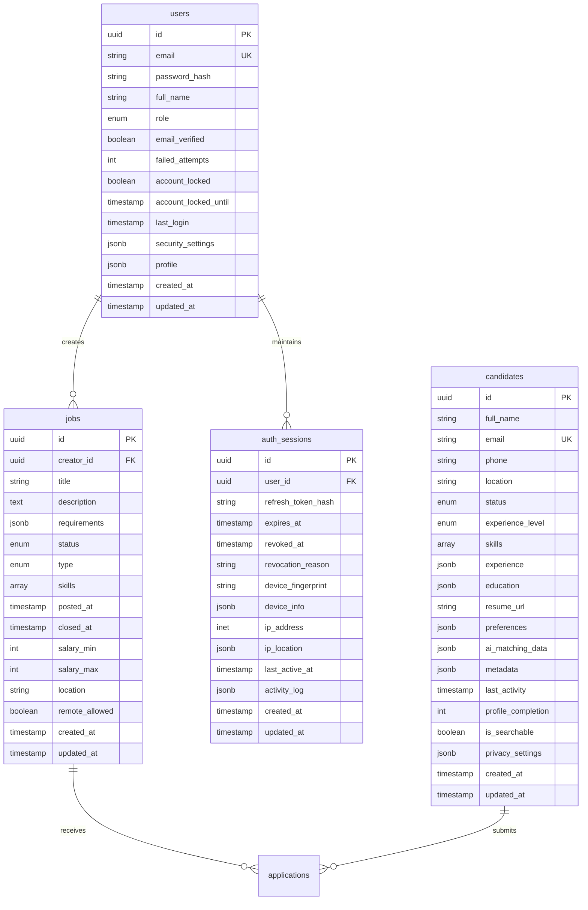

# HotGigs Database Schema Documentation

## Table of Contents
- [1. Overview](#1-overview)
- [2. Schema Diagram](#2-schema-diagram)
- [3. Tables](#3-tables)
  - [3.1 Users](#31-users)
  - [3.2 Jobs](#32-jobs)
  - [3.3 Candidates](#33-candidates)
  - [3.4 Auth Sessions](#34-auth-sessions)
- [4. Security Policies](#4-security-policies)
- [5. Indexing Strategy](#5-indexing-strategy)
- [6. Data Management](#6-data-management)

## 1. Overview

The HotGigs database schema is designed to support a modern recruitment management system with AI-powered matching capabilities. Built on PostgreSQL 14+, it implements comprehensive security controls, optimized indexing, and efficient data organization patterns.

### Key Features
- Row-Level Security (RLS) for fine-grained access control
- Full-text search capabilities using GiST indexes
- JSON/JSONB support for flexible data structures
- Automated timestamp management
- Comprehensive audit trails
- Partitioning for high-volume tables

## 2. Schema Diagram



## 3. Tables

### 3.1 Users

Primary table for user authentication and profile management.

```sql
CREATE TABLE auth.users (
  id UUID PRIMARY KEY DEFAULT gen_random_uuid(),
  email TEXT UNIQUE NOT NULL,
  password_hash TEXT NOT NULL,
  full_name TEXT NOT NULL,
  role TEXT NOT NULL CHECK (role IN ('ADMIN', 'RECRUITER', 'HIRING_MANAGER', 'CANDIDATE', 'GUEST')),
  email_verified BOOLEAN DEFAULT FALSE,
  failed_attempts INTEGER DEFAULT 0,
  account_locked BOOLEAN DEFAULT FALSE,
  account_locked_until TIMESTAMPTZ,
  last_login TIMESTAMPTZ,
  last_password_change TIMESTAMPTZ NOT NULL DEFAULT NOW(),
  password_history JSONB DEFAULT '[]',
  allowed_ip_addresses TEXT[] DEFAULT '{}',
  mfa_enabled BOOLEAN DEFAULT FALSE,
  mfa_secret TEXT,
  security_settings JSONB NOT NULL DEFAULT '{"require_mfa": false, "password_expiry_days": 90, "max_sessions": 5, "ip_whitelist_enabled": false}',
  profile JSONB NOT NULL DEFAULT '{}',
  created_at TIMESTAMPTZ NOT NULL DEFAULT NOW(),
  updated_at TIMESTAMPTZ NOT NULL DEFAULT NOW(),

  CONSTRAINT valid_email CHECK (email ~* '^[A-Za-z0-9._%+-]+@[A-Za-z0-9.-]+\\.[A-Za-z]{2,}$')
);

-- Indexes
CREATE INDEX idx_users_email ON auth.users (email);
CREATE INDEX idx_users_role ON auth.users (role);
CREATE INDEX idx_users_email_verified ON auth.users (email_verified);
```

### 3.2 Jobs

Stores job postings with comprehensive matching attributes.

```sql
CREATE TABLE public.jobs (
  id UUID PRIMARY KEY DEFAULT gen_random_uuid(),
  creator_id UUID NOT NULL REFERENCES auth.users(id),
  title VARCHAR(100) NOT NULL,
  description TEXT NOT NULL,
  requirements JSONB NOT NULL,
  status VARCHAR(20) NOT NULL DEFAULT 'DRAFT',
  type VARCHAR(20) NOT NULL,
  skills TEXT[] NOT NULL,
  posted_at TIMESTAMPTZ,
  closed_at TIMESTAMPTZ,
  salary_min INTEGER NOT NULL CHECK (salary_min >= 0),
  salary_max INTEGER NOT NULL CHECK (salary_max >= salary_min),
  location VARCHAR(100) NOT NULL,
  remote_allowed BOOLEAN NOT NULL DEFAULT false,
  created_at TIMESTAMPTZ NOT NULL DEFAULT NOW(),
  updated_at TIMESTAMPTZ NOT NULL DEFAULT NOW(),

  CONSTRAINT salary_range_check CHECK (
    salary_max <= 1000000 AND
    salary_min >= 0 AND
    salary_max >= salary_min
  ),
  CONSTRAINT title_length_check CHECK (
    length(title) >= 10 AND
    length(title) <= 100
  ),
  CONSTRAINT description_length_check CHECK (
    length(description) >= 50 AND
    length(description) <= 5000
  )
);

-- Indexes
CREATE INDEX idx_jobs_title ON public.jobs USING GiST (title gist_trgm_ops);
CREATE INDEX idx_jobs_status ON public.jobs (status);
CREATE INDEX idx_jobs_type ON public.jobs (type);
CREATE INDEX idx_jobs_skills ON public.jobs USING GIN (skills);
CREATE INDEX idx_jobs_salary ON public.jobs (salary_min, salary_max);
CREATE INDEX idx_jobs_location ON public.jobs (location);
CREATE INDEX idx_jobs_posted_at ON public.jobs (posted_at);
```

### 3.3 Candidates

Manages candidate profiles with AI matching capabilities.

```sql
CREATE TABLE public.candidates (
  id UUID PRIMARY KEY DEFAULT gen_random_uuid(),
  full_name TEXT NOT NULL,
  email TEXT UNIQUE NOT NULL,
  phone TEXT NOT NULL,
  location TEXT NOT NULL,
  status TEXT NOT NULL,
  experience_level TEXT NOT NULL,
  skills TEXT[] NOT NULL,
  experience JSONB NOT NULL DEFAULT '[]',
  education JSONB NOT NULL DEFAULT '[]',
  resume_url TEXT NOT NULL,
  preferences JSONB NOT NULL,
  ai_matching_data JSONB NOT NULL,
  metadata JSONB,
  last_activity TIMESTAMPTZ NOT NULL DEFAULT NOW(),
  profile_completion INTEGER NOT NULL DEFAULT 0,
  is_searchable BOOLEAN NOT NULL DEFAULT true,
  privacy_settings JSONB NOT NULL DEFAULT '{"share_profile": true, "share_contact": true, "share_education": true, "share_experience": true}',
  created_at TIMESTAMPTZ NOT NULL DEFAULT NOW(),
  updated_at TIMESTAMPTZ NOT NULL DEFAULT NOW(),

  CONSTRAINT valid_email CHECK (email ~* '^[A-Za-z0-9._%+-]+@[A-Za-z0-9.-]+\\.[A-Za-z]{2,}$'),
  CONSTRAINT valid_phone CHECK (phone ~* '^\+?[1-9]\d{1,14}$'),
  CONSTRAINT valid_profile_completion CHECK (profile_completion >= 0 AND profile_completion <= 100)
);

-- Indexes
CREATE INDEX idx_candidates_email ON public.candidates (email);
CREATE INDEX idx_candidates_skills ON public.candidates USING GIN (skills);
CREATE INDEX idx_candidates_location ON public.candidates (location);
CREATE INDEX idx_candidates_status ON public.candidates (status);
CREATE INDEX idx_candidates_experience_level ON public.candidates (experience_level);
CREATE INDEX idx_candidates_last_activity ON public.candidates (last_activity);
```

### 3.4 Auth Sessions

Tracks authentication sessions with security monitoring.

```sql
CREATE TABLE auth.sessions (
  id UUID PRIMARY KEY DEFAULT gen_random_uuid(),
  user_id UUID NOT NULL REFERENCES auth.users(id) ON DELETE CASCADE,
  refresh_token_hash TEXT NOT NULL,
  expires_at TIMESTAMPTZ NOT NULL,
  revoked_at TIMESTAMPTZ,
  revocation_reason TEXT,
  device_fingerprint TEXT NOT NULL,
  device_info JSONB NOT NULL,
  ip_address INET NOT NULL,
  ip_location JSONB,
  last_active_at TIMESTAMPTZ NOT NULL DEFAULT NOW(),
  activity_log JSONB DEFAULT '[]',
  created_at TIMESTAMPTZ NOT NULL DEFAULT NOW(),
  updated_at TIMESTAMPTZ NOT NULL DEFAULT NOW(),

  CONSTRAINT valid_expires_at CHECK (expires_at > created_at)
);

-- Indexes
CREATE INDEX idx_sessions_user_id ON auth.sessions (user_id);
CREATE INDEX idx_sessions_expires_at ON auth.sessions (expires_at);
CREATE INDEX idx_sessions_device_fingerprint ON auth.sessions (device_fingerprint);
```

## 4. Security Policies

### Row Level Security (RLS)

```sql
-- Users table policies
ALTER TABLE auth.users ENABLE ROW LEVEL SECURITY;

CREATE POLICY admin_all ON auth.users
  TO authenticated
  USING (auth.jwt() ->> 'role' = 'ADMIN');

CREATE POLICY user_select ON auth.users
  FOR SELECT
  TO authenticated
  USING (id::text = auth.jwt() ->> 'sub');

-- Jobs table policies
ALTER TABLE public.jobs ENABLE ROW LEVEL SECURITY;

CREATE POLICY view_published_jobs ON public.jobs
  FOR SELECT
  USING (status = 'PUBLISHED');

CREATE POLICY manage_own_jobs ON public.jobs
  FOR ALL
  USING (creator_id = auth.uid());

-- Candidates table policies
ALTER TABLE public.candidates ENABLE ROW LEVEL SECURITY;

CREATE POLICY view_searchable_candidates ON public.candidates
  FOR SELECT
  USING (is_searchable = true);

CREATE POLICY manage_own_profile ON public.candidates
  FOR ALL
  USING (id::text = auth.jwt() ->> 'sub');
```

## 5. Indexing Strategy

### Performance Optimization Indexes

- Full-text search using GiST indexes for job titles and descriptions
- GIN indexes for array fields (skills)
- B-tree indexes for common filter fields
- Composite indexes for frequently combined queries
- Partial indexes for specific conditions

### Maintenance

```sql
-- Regular index maintenance
CREATE OR REPLACE FUNCTION maintenance.reindex_tables()
RETURNS void AS $$
BEGIN
  REINDEX TABLE auth.users;
  REINDEX TABLE public.jobs;
  REINDEX TABLE public.candidates;
  REINDEX TABLE auth.sessions;
END;
$$ LANGUAGE plpgsql;

SELECT cron.schedule(
  'reindex-tables',
  '0 0 * * 0',  -- Weekly on Sunday at midnight
  $$SELECT maintenance.reindex_tables()$$
);
```

## 6. Data Management

### Partitioning Strategy

```sql
-- Time-based partitioning for high-volume tables
CREATE TABLE public.applications (
  id UUID NOT NULL,
  job_id UUID NOT NULL,
  candidate_id UUID NOT NULL,
  status TEXT NOT NULL,
  applied_at TIMESTAMPTZ NOT NULL,
  -- other columns
  PRIMARY KEY (id, applied_at)
) PARTITION BY RANGE (applied_at);

-- Create monthly partitions
CREATE TABLE applications_y2024m01 PARTITION OF applications
  FOR VALUES FROM ('2024-01-01') TO ('2024-02-01');
```

### Archival Strategy

```sql
-- Archival function for old data
CREATE OR REPLACE FUNCTION maintenance.archive_old_data(
  days_threshold INTEGER
)
RETURNS void AS $$
BEGIN
  -- Archive old closed jobs
  INSERT INTO archived.jobs
  SELECT * FROM public.jobs
  WHERE status = 'CLOSED'
    AND closed_at < NOW() - (days_threshold || ' days')::interval;

  -- Archive old sessions
  INSERT INTO archived.sessions
  SELECT * FROM auth.sessions
  WHERE expires_at < NOW() - (days_threshold || ' days')::interval;
END;
$$ LANGUAGE plpgsql;
```

### Automated Maintenance

```sql
-- Schedule maintenance tasks
SELECT cron.schedule(
  'cleanup-expired-sessions',
  '0 * * * *',  -- Every hour
  $$SELECT auth.cleanup_expired_sessions()$$
);

SELECT cron.schedule(
  'archive-old-data',
  '0 0 1 * *',  -- Monthly
  $$SELECT maintenance.archive_old_data(365)$$
);
```