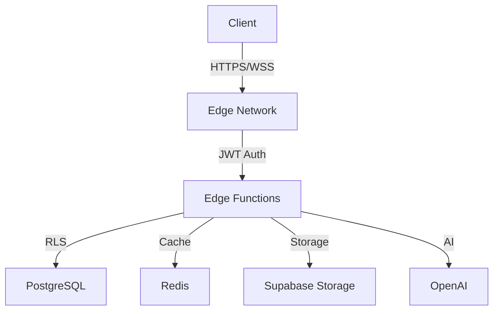

# Edge Functions Architecture Documentation

## Overview

HotGigs platform utilizes Supabase Edge Functions to deliver low-latency, globally distributed compute capabilities. This document outlines the architecture, implementation patterns, and deployment guidelines for edge functions.

## Architecture

### Core Components



### Function Types

1. **API Functions**
   - REST endpoints for CRUD operations
   - WebSocket handlers for real-time updates
   - Rate-limited and authenticated access

2. **Background Functions**
   - Asynchronous job processing
   - AI-powered matching computations
   - Data aggregation and analytics

3. **Utility Functions**
   - File processing and validation
   - Email notifications
   - External service integration

## Authentication & Security

### JWT Validation

```typescript
interface AuthToken {
  access_token: string;    // JWT token for API access
  refresh_token: string;   // Token for session renewal
  expires_in: number;      // Token validity duration
  token_type: string;      // Bearer authentication
  scope: string;          // Permission scope
  jti: string;           // Unique token identifier
  device_id: string;     // Client device tracking
}
```

### Security Controls

1. **Rate Limiting**
   - Default: 1000 requests/hour per IP
   - Burst: 50 requests/minute
   - Custom limits for specific endpoints

2. **Input Validation**
   ```typescript
   // Example job validation
   const jobSchema = z.object({
     title: z.string().min(1).max(255),
     description: z.string().min(1),
     requirements: jobRequirementsSchema,
     // ... other fields
   });
   ```

3. **Error Handling**
   ```typescript
   enum ErrorCode {
     VALIDATION_ERROR = 'VALIDATION_ERROR',
     NOT_FOUND = 'NOT_FOUND',
     UNAUTHORIZED = 'UNAUTHORIZED',
     FORBIDDEN = 'FORBIDDEN',
     INTERNAL_ERROR = 'INTERNAL_ERROR'
   }
   ```

## API Reference

### REST Endpoints

| Endpoint | Method | Rate Limit | Auth |
|----------|--------|------------|------|
| /api/jobs | GET, POST | 1000/hr | JWT |
| /api/candidates | GET, POST | 1000/hr | JWT |
| /api/applications | GET, POST | 2000/hr | JWT |
| /api/interviews | GET, POST | 500/hr | JWT |
| /api/analytics | GET | 100/hr | JWT |

### WebSocket Events

```typescript
// Real-time subscription channels
enum Channel {
  JOB_UPDATES = 'job_updates',
  APPLICATION_STATUS = 'application_status',
  INTERVIEW_SCHEDULE = 'interview_schedule',
  NOTIFICATIONS = 'notifications'
}
```

## Deployment

### Multi-Region Configuration

```typescript
const EDGE_REGIONS = [
  'us-east-1',
  'eu-west-1',
  'ap-southeast-1'
] as const;

const EDGE_CONFIG = {
  timeout: 10000,
  memory: 1024,
  maxDuration: 60
};
```

### Performance Optimization

1. **Caching Strategy**
   - Redis cache for frequent queries
   - 15-minute TTL default
   - Cache invalidation on updates

2. **Cold Start Mitigation**
   - Lazy loading of heavy dependencies
   - Connection pooling
   - Warm-up routines

## Monitoring & Maintenance

### Observability

```typescript
interface MetricData {
  function_name: string;
  execution_time: number;
  memory_usage: number;
  error_rate: number;
  cold_starts: number;
}
```

### Health Checks

1. **Endpoint Health**
   - 30-second intervals
   - Circuit breaker pattern
   - Automated failover

2. **Performance Metrics**
   - Response time < 100ms (p95)
   - Error rate < 0.1%
   - Availability > 99.9%

## Error Handling

### Standard Error Response

```typescript
interface ErrorResponse {
  code: ErrorCode;
  message: string;
  details: Record<string, unknown> | null;
}
```

### Retry Strategy

1. **Transient Failures**
   - Exponential backoff
   - Maximum 3 retries
   - Jitter implementation

2. **Circuit Breaker**
   - 5-minute break window
   - 50% error threshold
   - Gradual recovery

## Best Practices

1. **Code Organization**
   - Single responsibility principle
   - Modular function design
   - Shared utility libraries

2. **Security**
   - Input sanitization
   - Output encoding
   - Principle of least privilege

3. **Performance**
   - Minimal dependencies
   - Efficient data structures
   - Resource cleanup

## Version Control

### Function Versioning

```typescript
interface FunctionVersion {
  version: string;
  deprecated: boolean;
  sunset_date?: Date;
  migration_path?: string;
}
```

### Deployment Strategy

1. **Staging Process**
   - Feature branch testing
   - Integration validation
   - Canary deployments

2. **Rollback Plan**
   - Version tracking
   - State management
   - Data consistency

## Support & Troubleshooting

### Common Issues

1. **Cold Starts**
   - Cause: Initial function invocation
   - Solution: Warm-up routines
   - Prevention: Keep-alive pings

2. **Memory Leaks**
   - Cause: Resource retention
   - Solution: Proper cleanup
   - Prevention: Memory monitoring

### Debug Mode

```typescript
const DEBUG_CONFIG = {
  verbose: boolean;
  trace: boolean;
  logLevel: 'ERROR' | 'WARN' | 'INFO' | 'DEBUG';
};
```